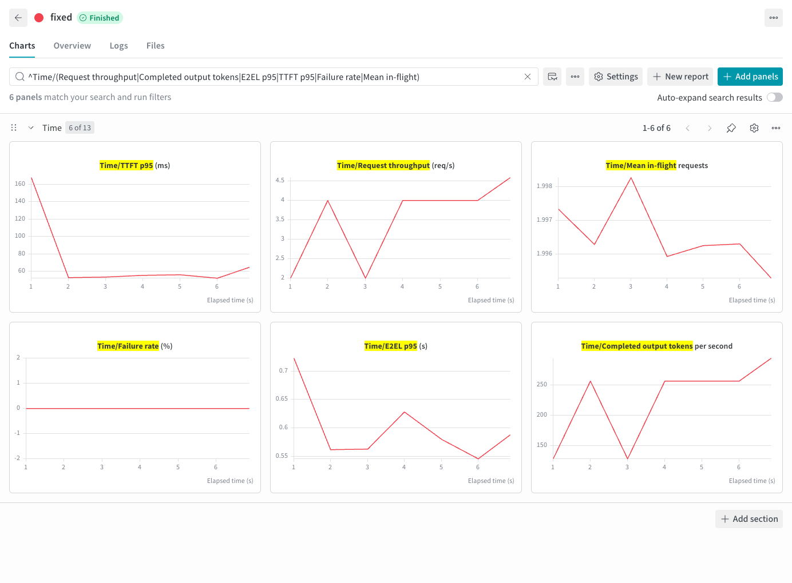

# Fixed prompts

English | [简体中文](fixed-prompt_zh.md) · [Common commands](../examples.md)

After [setup](../examples.md#setup), run from the repository root:

```bash
foretoken bench examples/quickstart \
  --prompt "Explain what a token is in one sentence." \
  --parallel 4 --number 20 --max-tokens 64 \
  --output local,wandb
```

Each request uses the same prompt. Without `--prompt` or `--dataset`, a Kustomize benchmark uses `Hello`.

## Example output

A short run against an existing service:



