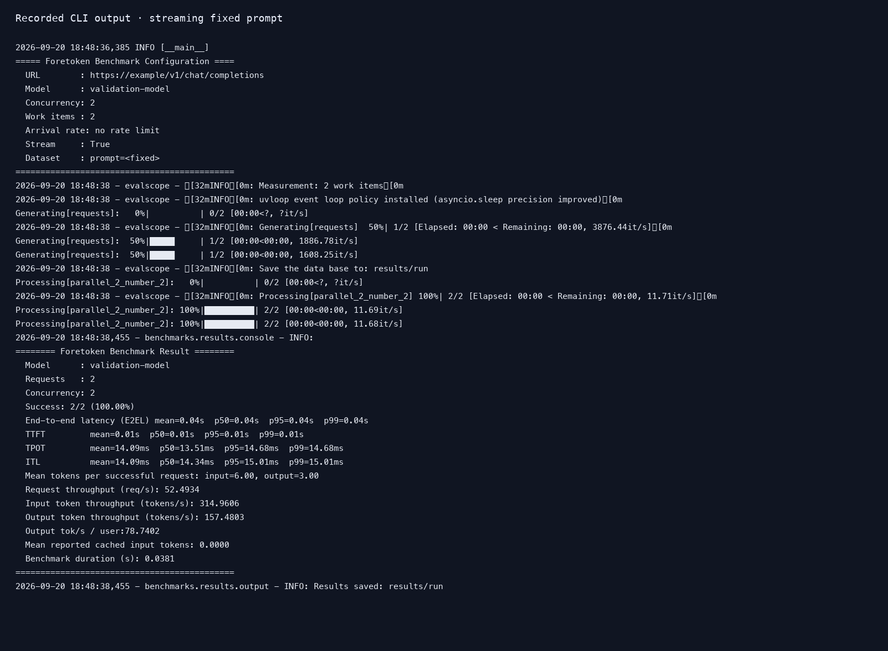

# 固定提示词

[English](fixed-prompt.md) | 简体中文 · [常用命令](../examples_zh.md)

完成[准备步骤](../examples_zh.md#准备)后，在仓库根目录运行：

```bash
foretoken bench examples/quickstart \
  --prompt "用一句话解释什么是 token。" \
  --parallel 4 --number 20 --max-tokens 64 \
  --output local,wandb
```

每次请求使用相同提示词。Kustomize 评测未指定 `--prompt` 或 `--dataset` 时使用 `Hello`。


