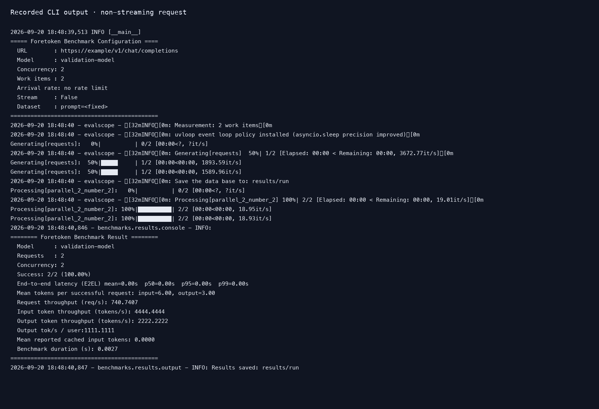
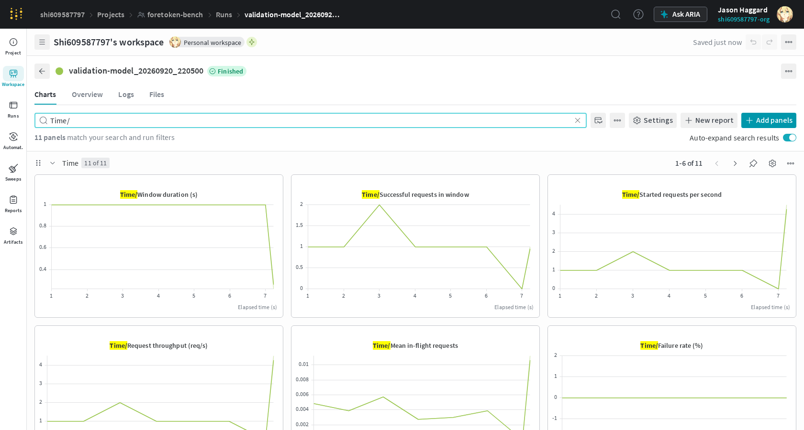

# Non-streaming requests

English | [简体中文](non-streaming_zh.md) · [Common commands](../examples.md)

After [setup](../examples.md#setup), run from the repository root:

```bash
foretoken bench examples/quickstart \
  --prompt "Name a planet." --no-stream \
  --number 20 --max-tokens 32 \
  --output local,wandb
```

The service returns the complete response at once. End-to-end latency and throughput remain available; TTFT, TPOT, and ITL are not reported.




