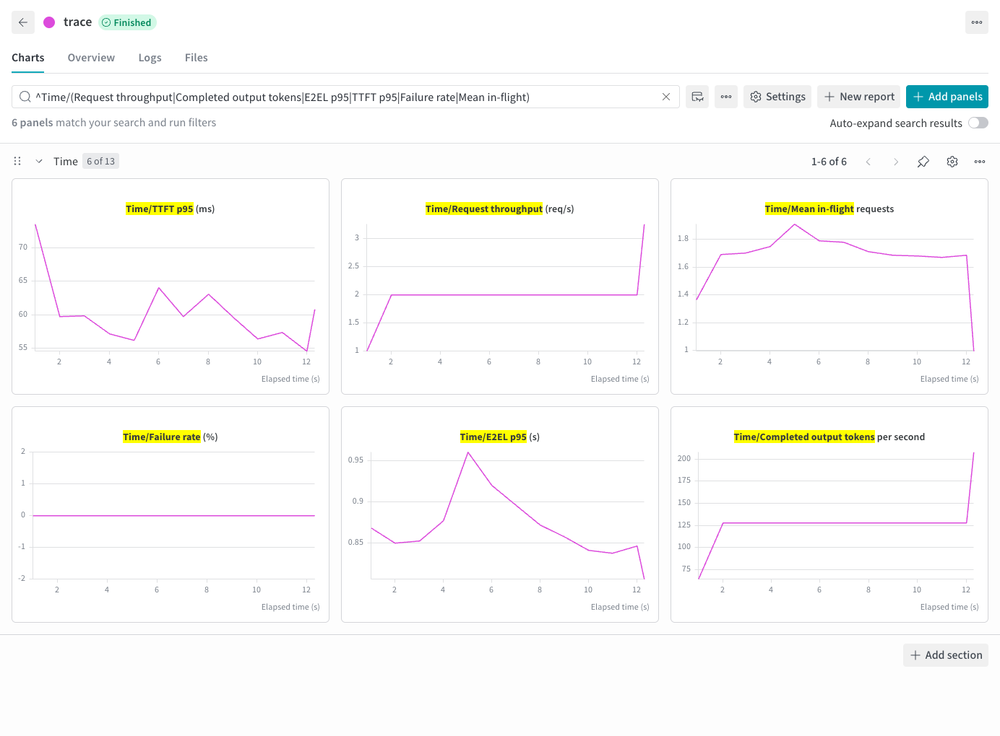

# StudyChat 轨迹回放

[English](studychat.md) | 简体中文 · [常用命令](../examples_zh.md)

完成[准备步骤](../examples_zh.md#准备)后，选择公开轨迹中一段有请求的短窗口：

```bash
foretoken perf examples/quickstart \
  --trace KrisQ/StudyChat --dataset KrisQ/StudyChat \
  --trace-start 18609050.546 --trace-duration 60 \
  --trace-max-concurrency 4 --max-tokens 32 \
  --output local,wandb
```

`--trace` 提供到达时间，`--dataset` 提供内容。选择同一来源时直接使用各记录的消息。起点偏移相对于数据集中最早的时间戳，记录之间可能有很长的空档；此命令只回放所选的 60 秒，不会先等待一千八百多万秒。并发等待计入回放延迟。

每条记录独立执行，请求数量和到达时间由窗口决定，不添加 `--num-prompts`、`--request-rate`、`--max-concurrency` 或正数 `--max-turns`。在途请求数由 `--trace-max-concurrency` 控制。

## 输出示例


