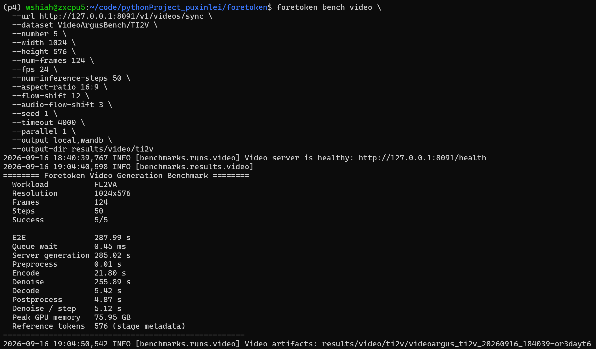
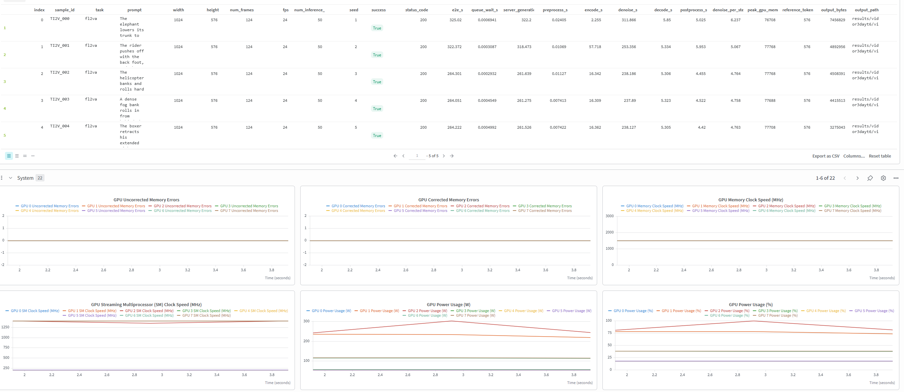
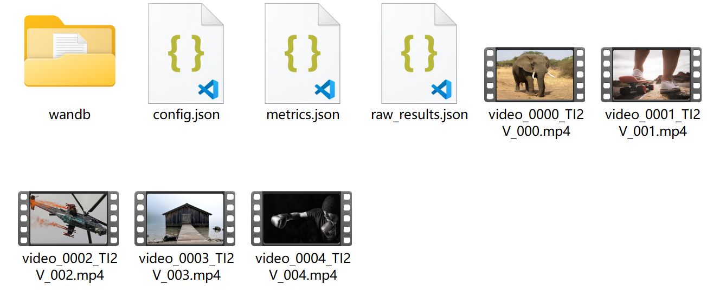
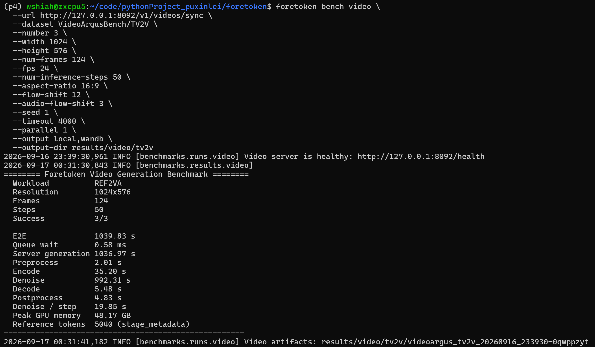
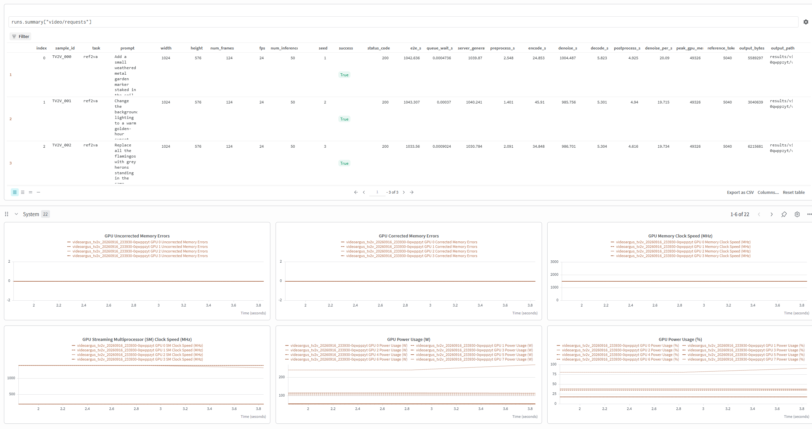
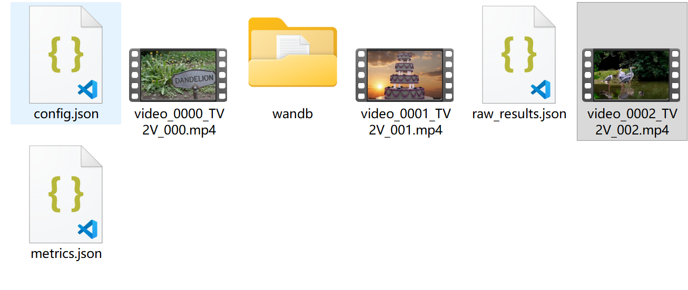

# 视频生成评测

[English](video.md) | 简体中文 · [常用命令](../examples_zh.md)

在仓库根目录中，针对已运行的同步视频生成端点执行评测。

## VideoArgusBench 数据集

| 数据集 selector | 服务端任务 |
| --- | --- |
| `VideoArgusBench/T2V` | `t2va` |
| `VideoArgusBench/TI2V` | `fl2va` |
| `VideoArgusBench/TS2V` | `ref2va` |
| `VideoArgusBench/TV2V` | `ref2va` |
| `VideoArgusBench/TSV2V` | `ref2va` |

## TI2V 评测

```bash
foretoken bench video \
  --url http://127.0.0.1:8091/v1/videos/sync \
  --dataset VideoArgusBench/TI2V \
  --number 10 \
  --width 1024 \
  --height 576 \
  --num-frames 124 \
  --fps 24 \
  --num-inference-steps 50 \
  --aspect-ratio 16:9 \
  --flow-shift 12 \
  --audio-flow-shift 3 \
  --seed 1 \
  --timeout 3600 \
  --parallel 1 \
  --output local,wandb \
  --output-dir results/video/ti2v
```

评测会在终端打印汇总结果，在本地保存生成视频和运行元数据，并在 W&B 中记录逐请求指标。通用输出设置见 [W&B 输出](wandb_zh.md)。







## TV2V 评测

```bash
foretoken bench video \
  --url http://127.0.0.1:8091/v1/videos/sync \
  --dataset VideoArgusBench/TV2V \
  --number 10 \
  --width 1024 \
  --height 576 \
  --num-frames 124 \
  --fps 24 \
  --num-inference-steps 50 \
  --aspect-ratio 16:9 \
  --flow-shift 12 \
  --audio-flow-shift 3 \
  --seed 1 \
  --timeout 3600 \
  --parallel 1 \
  --output local,wandb \
  --output-dir results/video/tv2v
```

结果目录结构和 W&B 上报方式与 TI2V 相同：






