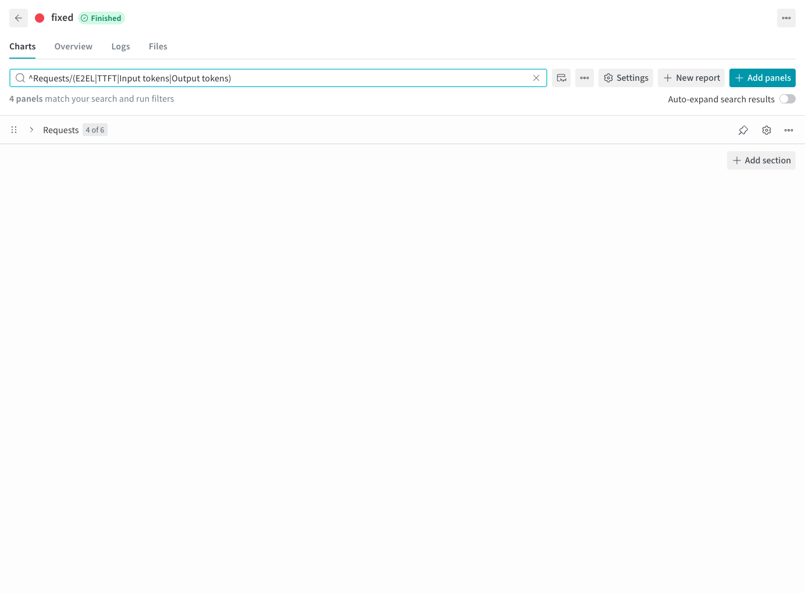

# W&B 输出

[English](wandb.md) | 简体中文 · [常用命令](../examples_zh.md)

完成[准备步骤](../examples_zh.md#准备)后，指定项目、分组和运行名称：

```bash
wandb login

foretoken perf examples/quickstart \
  --num-prompts 20 --output local,wandb \
  --wandb-project foretoken-bench \
  --wandb-group qwen-comparison \
  --wandb-run-name quickstart
```

`--wandb-entity` 选择账号或团队。group 和运行名分别设置。扫描、多数据集在未指定 group 时自动分组，各子运行会在名称后追加标识。单次评测默认不分组。

W&B 页面会展示最终汇总指标、P50/P95/P99 百分位指标，以及按时间、累计结果和逐请求统计的曲线。Kustomize 评测还会展示副本数变化。可在 group 的 Workspace 中对比各次运行，Summary 保留最终值。窗口定义见[结果指标](../../metrics_zh.md#曲线)。



仅本地输出用 `--output local`，不打印汇总用 `--output local,quiet`，仅上传用 `--output wandb`。显式选择 W&B 后，初始化、发布或结束运行失败会使命令失败，并保留已经生成的评测产物。
