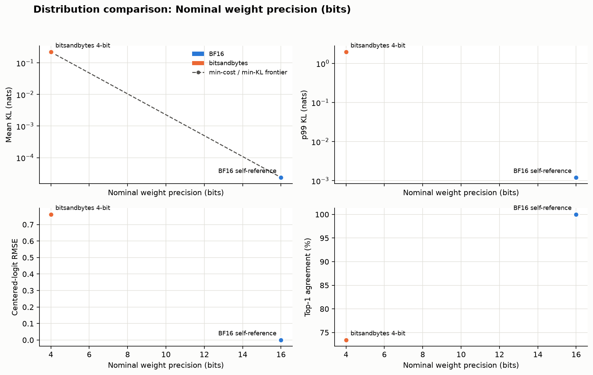
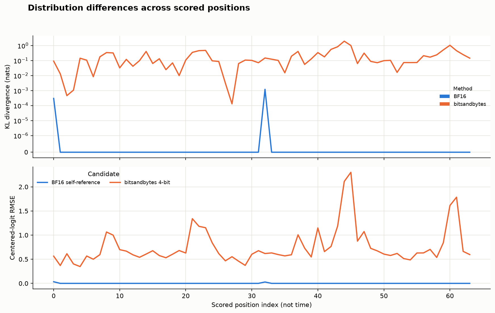

<!--
SPDX-License-Identifier: Apache-2.0
SPDX-FileCopyrightText: Copyright contributors to the Foretoken project
-->

# Compare model distributions

English | [简体中文](distribution-comparison_zh.md) · [Quality evaluation](README.md)

Add `--reference` to `foretoken eval` to measure how a candidate model's next-token probabilities differ from a reference. The comparison reports full-vocabulary KL divergence, Top-1/Top-k agreement, and logit differences, with local plots and W&B output.

## Compare a quantized model

Use the [quantized-model examples](../../../examples/quantized-model/README.md) with a source-installed Foretoken platform and their configured model storage. From the repository root:

```bash
foretoken eval examples/quantized-model/bitsandbytes \
  --reference examples/quantized-model/bf16 \
  --output local
```

Both deployments use Qwen2.5-0.5B-Instruct with BF16 computation; the candidate loads its weights in 4-bit. Model and tokenizer settings come from the reference deployment. Existing deployments are reused; temporary deployments run sequentially and are removed after use, so one available GPU is sufficient when both are temporary.

The examples enable full-vocabulary output. For a deployment created from older example files, apply the updated Kustomize directory with `foretoken deploy PATH` before comparing.

## Read the results

The summary compares candidates using these metrics:

| Metric | Interpretation |
| --- | --- |
| Mean, median, p99 KL | `KL(reference || candidate)` over the complete vocabulary, in nats; lower is closer |
| Top-1 agreement | Fraction of positions with the same most-probable token |
| Top-k overlap | Shared top-k tokens divided by k; defaults to k=5 and 10, configurable with `--top-k` |
| Corpus-token probability change | Candidate minus reference probability for the original text token; mean shows direction, RMS shows magnitude |
| Centered-logit RMSE | Root-mean-square difference after subtracting each vector's mean log probability; invariant to a common logit offset |
| Total variation | Half the sum of absolute probability differences |

The result directory contains a candidate table (`distribution_comparison_candidates.csv`), per-position records (`distribution_comparison_positions.jsonl`), and PNG plots. `metrics.json` records the sample settings and completion status. Add `wandb` to `--output` to publish tables, curves, and images.

These plots compare Qwen3-0.6B BF16 and bitsandbytes 4-bit through existing endpoints, using two 96-token WikiText-2 windows and scoring their last 32 positions:





Use [task evaluation](README.md) for answer quality and [performance evaluation](../perf/README.md) for serving speed.

## Choose the comparison sample

The default corpus is [WikiText-2](https://huggingface.co/datasets/Salesforce/wikitext), configuration `wikitext-2-raw-v1`, test split. Four non-overlapping 512-token windows are sampled, scoring the last 16 positions of each: 64 paired positions per candidate. Each prefix comes from the original corpus rather than generated answers; this is teacher forcing.

Use `--dataset corpus.txt` for local text, or `--dataset corpus.jsonl` for records containing a `text` field. `--text-column` selects another field. Hugging Face datasets also accept `--dataset-config` and `--split`. Adjust sample size with `--context-length`, `--num-windows`, and `--score-tokens`. A tokenizer-defined beginning-of-sequence token is added to each window.

## Compare several candidates

The maintained [candidate list](../../../examples/quantized-model/candidates.jsonl) contains BF16 and bitsandbytes with method and nominal bit-width labels:

```bash
foretoken eval \
  --reference examples/quantized-model/bf16 \
  --candidates examples/quantized-model/candidates.jsonl \
  --output local,wandb
```

To customize the list, write one JSON object per candidate, following that file. Each row selects `path`, or `url` with its `model`; rows without either reuse the command's candidate service. Paths are relative to the command's working directory. Single-model deployments supply their model IDs. Labels default to deployment directory names or model IDs; use `label` to distinguish identical names.

For one candidate, `--label` and `--method` annotate the plots. Deployments supply the quantization method from `engineArgs` when no method label is given. Optional size coordinates produce separate comparison plots; without them, the horizontal axis uses candidate names:

| Candidate field / CLI option | Meaning |
| --- | --- |
| `weight_bits` / `--weight-bits` | Nominal weight precision |
| `bits_per_weight` / `--bits-per-weight` | Measured bits per weight, including quantization overhead |
| `model_size_gib` / `--model-size-gib` | Measured checkpoint size in GiB |

## Use existing endpoints

Supply the two service addresses and served model IDs, replacing the example values below. Both services need the same token-ID mapping and model vocabulary, and must support full-vocabulary probability output. Native vLLM uses `--max-logprobs -1`; custom Foretoken deployments set `max-logprobs: -1` in the model's `spec.engineArgs`.

```bash
foretoken eval \
  --url http://127.0.0.1:8008/v1/chat/completions --model quantized \
  --reference-url http://127.0.0.1:8009/v1/chat/completions \
  --reference-model Qwen/Qwen2.5-0.5B-Instruct \
  --output local
```

The reference model ID identifies its tokenizer and model configuration. If it is a serving alias, or its files exist only on cluster nodes, use `--tokenizer-path` with a base-model repository or client-local directory containing tokenizer files and `config.json`. Foretoken deployments resolve their configured Hugging Face, ModelScope, or client-accessible local source automatically, including a separately configured tokenizer.

With a shared endpoint, omit `--reference-url`. Authentication uses `--api-key`, with `--reference-api-key` for a different reference credential.

## Resume a comparison

Keep the complete local result directory. After an interruption, repeat the original command with `--resume` pointing to that directory. Replace `results/previous-run` below with the printed path:

```bash
foretoken eval examples/quantized-model/bitsandbytes \
  --reference examples/quantized-model/bf16 \
  --resume results/previous-run --output local
```

Completed windows and saved corpus tokens are reused; an interrupted window is recomputed in full. A completed reference or candidate needs no deployment or requests. Keep the same models, weights, tokenizer, candidates, and scoring settings. Results are written to a new directory, leaving the previous run unchanged.
