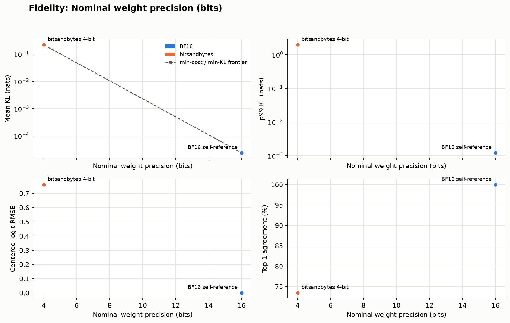
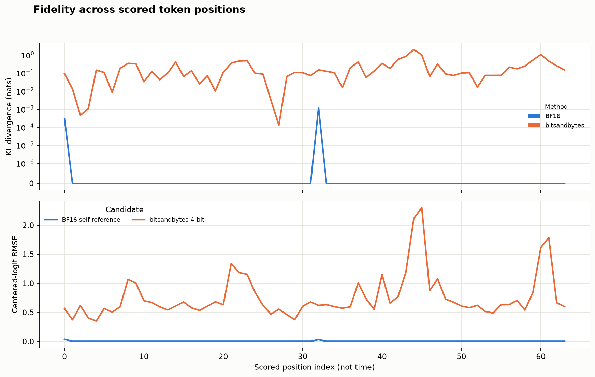

<!--
SPDX-License-Identifier: Apache-2.0
SPDX-FileCopyrightText: Copyright contributors to the Foretoken project
-->

# Compare model distributions

English | [简体中文](fidelity_zh.md) · [Quality evaluation](README.md)

Adding `--reference` to `foretoken eval` compares a candidate model's next-token probabilities with a reference. It reports full-vocabulary KL divergence, Top-1/Top-k agreement, and logit differences, with local plots and W&B output.
## Compare a quantized model

Use the [quantized-model examples](../../../examples/quantized-model/README.md) with a source-installed Foretoken platform and their configured model storage. From the repository root:

```bash
foretoken eval examples/quantized-model/bitsandbytes \
  --reference examples/quantized-model/bf16 \
  --output local
```

Both deployments use Qwen2.5-0.5B-Instruct with BF16 computation; the candidate loads its weights in 4-bit. The command reads the reference model and tokenizer from its deployment. It reuses existing deployments or creates and removes temporary ones, evaluating the reference before the candidate so a single available GPU is sufficient when both are temporary.

The examples already allow full-vocabulary probability output. For an existing deployment created from older example files, apply the updated files with `foretoken deploy PATH` before comparing. For a custom deployment, set `max-logprobs: -1` in the model's `spec.engineArgs`; native vLLM services use `--max-logprobs -1`.

## Compare several candidates

The maintained list contains BF16 and bitsandbytes candidates with method and nominal bit-width labels:

```bash
foretoken eval \
  --reference examples/quantized-model/bf16 \
  --candidates examples/quantized-model/candidates.jsonl \
  --output local,wandb
```

For a custom list, write one JSON object per line:

```jsonl
{"path":"examples/quantized-model/bf16","label":"BF16","method":"BF16","weight_bits":16}
{"path":"examples/quantized-model/bitsandbytes","label":"4-bit","method":"bitsandbytes","weight_bits":4}
```

Paths are relative to the command's working directory. Each row can select `path`, or `url` with its `model`. Rows without either reuse the command's candidate service. A single-model deployment supplies its own model ID. Labels default to deployment directory names or model IDs; set distinct `label` values when comparing otherwise identical names.

For one candidate, `--label`, `--method`, and `--weight-bits` are optional plot annotations. Deployment comparisons read the quantization method from `engineArgs` when no method label is supplied. Effective bit width and checkpoint size are optional measured coordinates, not required inputs:

| Candidate field / CLI option | Meaning |
| --- | --- |
| `weight_bits` / `--weight-bits` | Nominal weight precision |
| `bits_per_weight` / `--bits-per-weight` | Measured bits per weight, including quantization overhead |
| `model_size_gib` / `--model-size-gib` | Measured checkpoint size in GiB |

Each supplied coordinate produces a separate comparison plot. Without size coordinates, plots use candidate names.

## Use existing endpoints

Pass the candidate and reference service addresses and their served model IDs:

```bash
foretoken eval \
  --url http://127.0.0.1:8008/v1/chat/completions --model quantized \
  --reference-url http://127.0.0.1:8009/v1/chat/completions \
  --reference-model Qwen/Qwen3-0.6B \
  --output local
```

Replace these addresses and IDs with the actual services. The reference model ID is used to obtain its tokenizer and model configuration. If it is only a serving alias, or its files exist only on cluster nodes, use `--tokenizer-path` to select a base-model repository or client-local directory containing both tokenizer files and `config.json`. Foretoken deployments resolve their configured Hugging Face, ModelScope, or client-accessible local source automatically, including a separately configured tokenizer.

Both services must use the same token-ID mapping and model vocabulary. With a shared endpoint, omit `--reference-url`. Authentication uses `--api-key`, with `--reference-api-key` for a different reference credential.

## Choose the comparison sample

The default corpus is [WikiText-2](https://huggingface.co/datasets/Salesforce/wikitext), configuration `wikitext-2-raw-v1`, test split. Four non-overlapping 512-token windows are sampled, scoring the last 16 positions of each: 64 paired positions per candidate. Each prefix comes from the original corpus rather than generated answers; this is teacher forcing.

Use `--dataset corpus.txt` for local text, or `--dataset corpus.jsonl` for records containing a `text` field. `--text-column` selects another field. Hugging Face datasets also accept `--dataset-config` and `--split`. Adjust sample size with `--context-length`, `--num-windows`, and `--score-tokens`. A tokenizer-defined beginning-of-sequence token is added to each window.

## Resume a comparison

Repeat the original comparison command with `--resume` pointing to its result directory. Replace `results/previous-run` with the directory printed by the interrupted run:

```bash
foretoken eval examples/quantized-model/bitsandbytes \
  --reference examples/quantized-model/bf16 \
  --resume results/previous-run --output local
```

Completed windows are reused; an interrupted window is recomputed in full. The saved corpus tokens are reused exactly. A completed reference or candidate needs no deployment or requests. Keep the same models, weights, tokenizer, candidates, and scoring settings. Results are written to a new directory, leaving the previous run unchanged.

## Read the results

| Metric | Interpretation |
| --- | --- |
| Mean, median, p99 KL | `KL(reference || candidate)` over the complete vocabulary, in nats; lower is closer |
| Top-1 agreement | Fraction of positions with the same most-probable token |
| Top-k overlap | Shared top-k tokens divided by k; defaults to k=5 and 10, configurable with `--top-k` |
| Reference-token probability change | Candidate minus reference probability for the corpus token; mean shows direction, RMS shows magnitude |
| Centered-logit RMSE | Root-mean-square difference after subtracting each vector's mean log probability; invariant to a common logit offset |
| Total variation | Half the sum of absolute probability differences |

The following plots compare Qwen3-0.6B BF16 and bitsandbytes 4-bit through existing endpoints, using two 96-token WikiText-2 windows and scoring their last 32 positions.





The printed result directory contains `fidelity_candidates.csv`, `fidelity_tokens.jsonl`, and PNG plots; `metrics.json` records the protocol and completion status. Add `wandb` to `--output` to publish the tables, curves, and images. Keep the complete local result directory to retain the sampled tokens, reference probabilities, and scoring progress for resume. Use [task evaluation](README.md) for answer quality and [performance evaluation](../perf/README.md) for serving speed.
