# Random dataset

```
foretoken bench \
  --url http://127.0.0.1:8008/v1/chat/completions \
  --model Qwen3.6-27B \
  --dataset random \
  --tokenizer-path Qwen/Qwen3.6-27B \
  --min-prompt-length 128 --max-prompt-length 512 \
  --parallel 4 --number 20 --max-tokens 64 \
  --rate 5 \
  --wandb
```

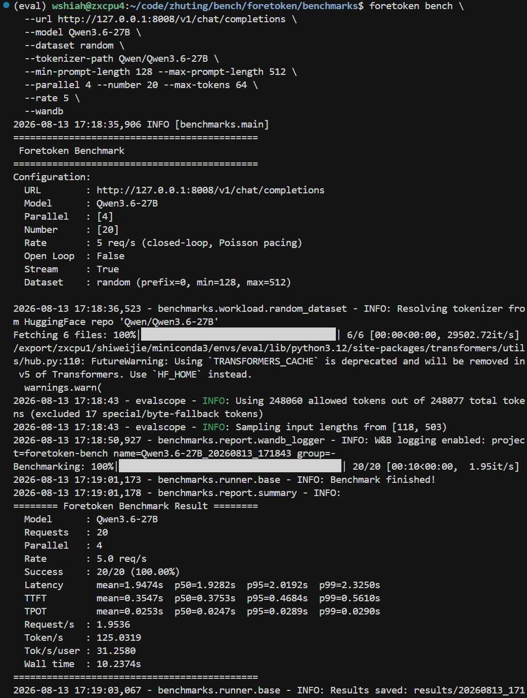

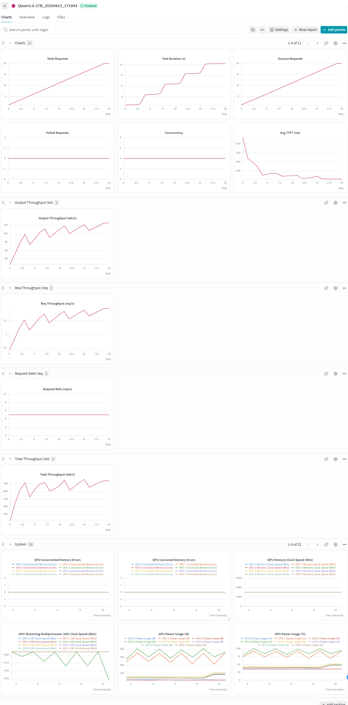

# HuggingFace dataset

```
foretoken bench \
  --url http://127.0.0.1:8008/v1/chat/completions \
  --model Qwen3.6-27B \
  --dataset weijiezz/foretoken-trace:conversation \
  --parallel 4 \
  --number 20 \
  --wandb
```


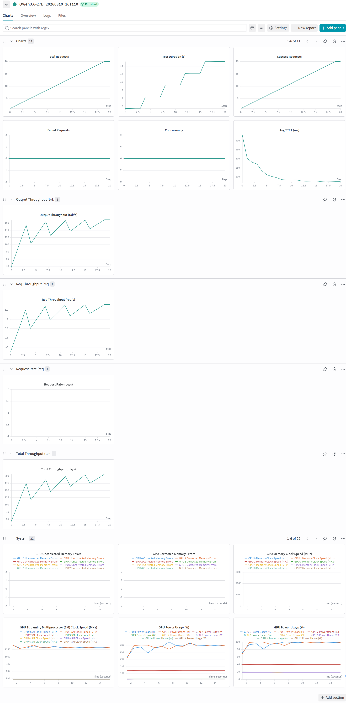

# Local dataset

```
foretoken bench \
  --url http://127.0.0.1:8008/v1/chat/completions \
  --model Qwen3.6-27B \
  --dataset /home/wshiah/code/zhuting/foretoken/conversation.jsonl \
  --parallel 4 \
  --number 20 \
  --wandb
```

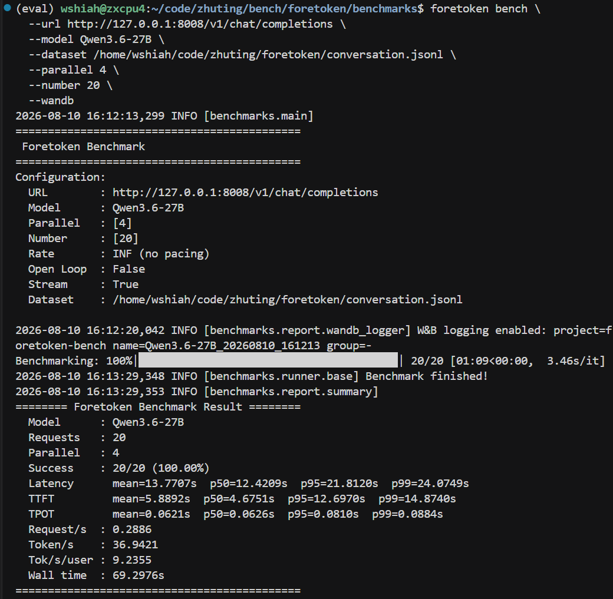

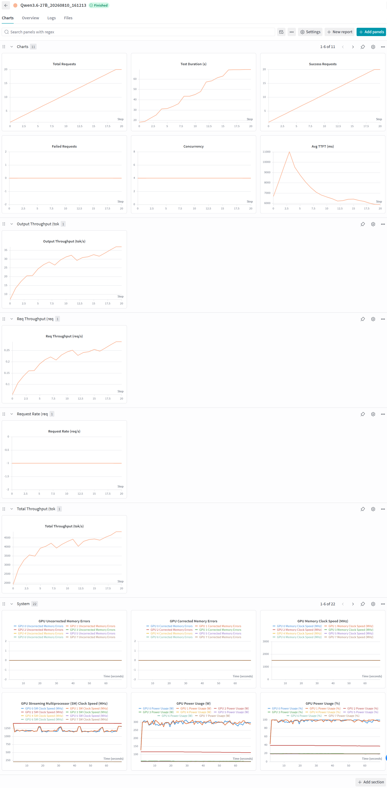

# Multi-dataset

```
foretoken bench \
  --url http://127.0.0.1:8008/v1/chat/completions \
  --model Qwen3.6-27B \
  --dataset r0b0tlab/qwen3.8-max-distillation-50k:train,ianncity/GLM-5.2-Conversation:train \
  --parallel 4 \
  --number 20 \
  --wandb
```

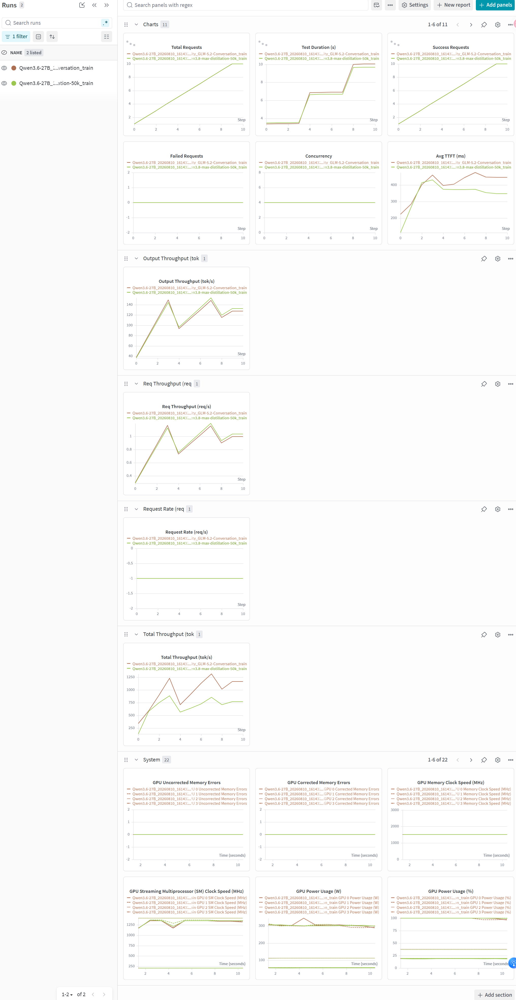

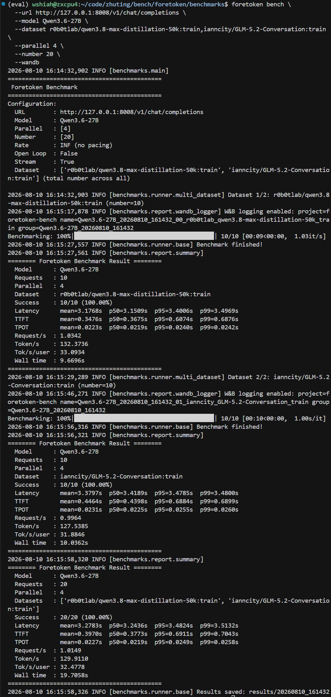

# Load sweep (concurrency) + Pareto

```
foretoken bench \
  --url http://127.0.0.1:8008/v1/chat/completions \
  --model Qwen3.6-27B \
  --dataset random \
  --tokenizer-path Qwen/Qwen3.6-27B \
  --min-prompt-length 128 --max-prompt-length 512 \
  --parallel 1,2,4,8 --number 20 --max-tokens 64 \
  --gpu-count 2 \
  --wandb
```

After all points finish, results include `pareto/PARETO.png`
(X = Tok/s/user, Y = Tok/s/GPU).

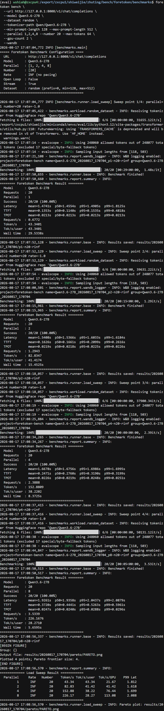

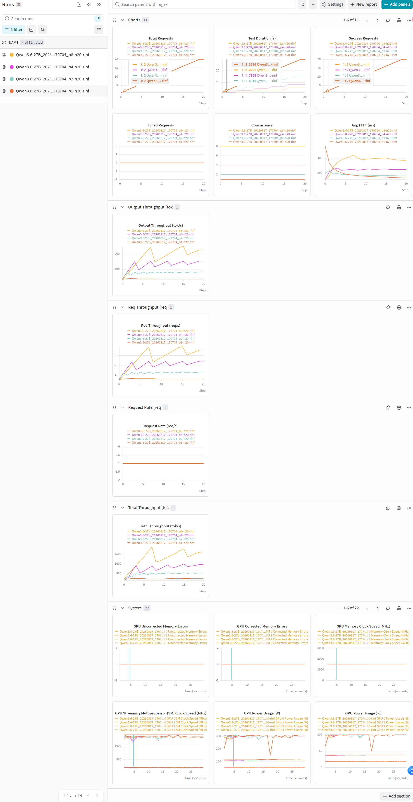


# Param sweep (bench-params)

Bench JSON overrides load / generation / dataset fields per combination.
Example: `examples/bench_params.json`.

```
foretoken bench \
  --url http://127.0.0.1:8008/v1/chat/completions \
  --model Qwen3.6-27B \
  --dataset random \
  --tokenizer-path Qwen/Qwen3.6-27B \
  --min-prompt-length 128 --max-prompt-length 512 \
  --bench-params examples/bench_params.json \
  --gpu-count 2 \
  --wandb
```

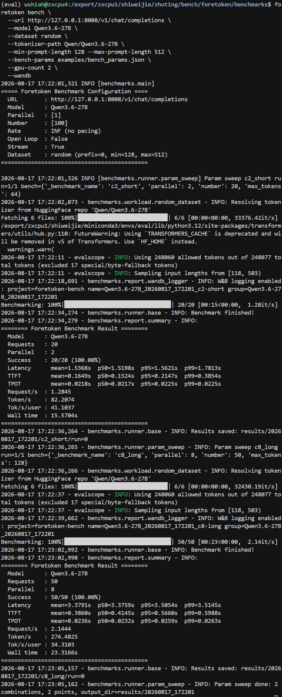

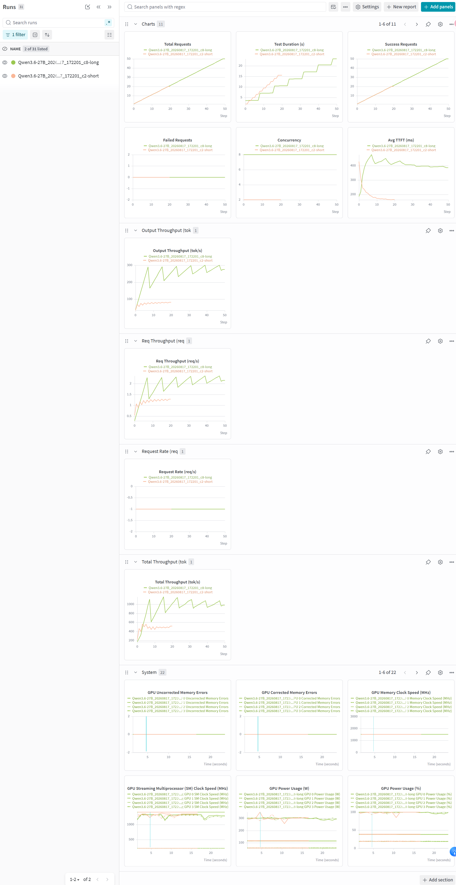
