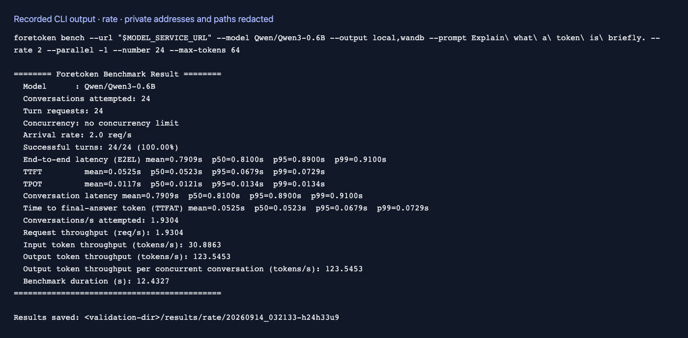
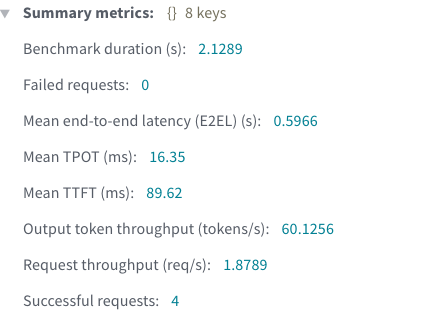

# 到达模式与并发

[English](arrival-rate.md) | 简体中文 · [性能评测示例](README_zh.md)

完成[准备步骤](README_zh.md#准备)后，按平均每秒 5 个请求发送，同时最多允许 16 个请求在途：

```bash
foretoken perf examples/quickstart \
  --prompt "你好" --request-rate 5 --max-concurrency 16 --num-prompts 100 \
  --output local,wandb
```

`--request-rate` 控制目标请求速率，`--max-concurrency` 限制在途请求数。默认 `--arrival-pattern poisson` 使用泊松到达；`constant` 使用固定间隔，`gamma` 配合 `--burstiness` 表达突发程度；需要按时间戳回放时单独使用 `--trace`。`--request-rate -1` 表示尽快发送，`--max-concurrency -1` 表示取消并发上限。默认不限速、并发为 1。生成式到达、多轮对话和多个数据集使用相同的请求速率、并发、预热和时长控制。

去掉并发上限：

```bash
foretoken perf examples/quickstart \
  --prompt "你好" --request-rate 5 --max-concurrency -1 --num-prompts 100 \
  --output local,wandb
```

`--request-rate -1 --max-concurrency -1` 会尽快启动请求预算内的请求。添加 `--duration SECONDS` 可按墙上时钟停止新的请求准入；省略 `--num-prompts` 时使用时长作为工作负载边界。多轮数据共享 HTTP 请求预算，`--max-concurrency` 限制同时执行的对话数。

使用固定间隔或 Gamma 到达：

```bash
foretoken perf examples/quickstart \
  --prompt "你好" --request-rate 5 --arrival-pattern constant \
  --max-concurrency 16 --num-prompts 100 --output local,wandb

foretoken perf examples/quickstart \
  --prompt "你好" --request-rate 5 --arrival-pattern gamma \
  --burstiness 0.5 --max-concurrency 16 --num-prompts 100 --output local,wandb
```

## 输出示例

以下为较低到达率的小规模运行：




