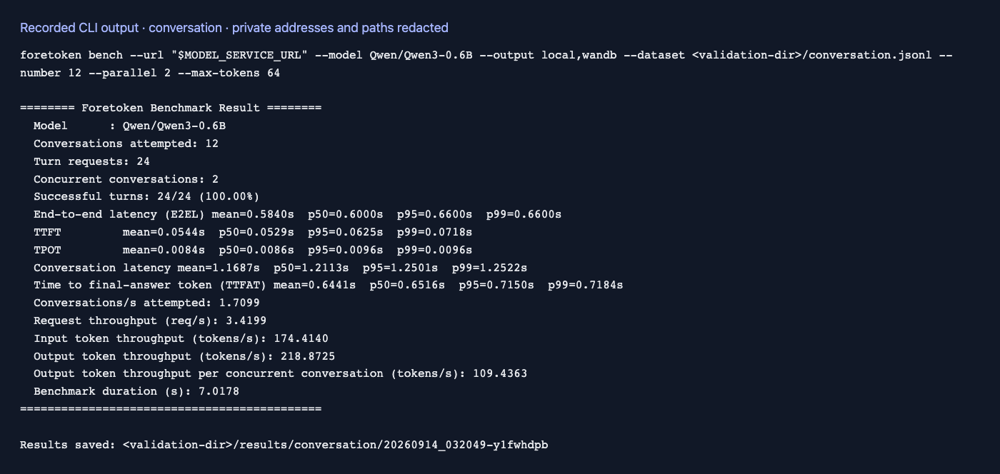
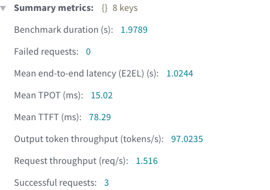

# Local conversations

English | [简体中文](conversations_zh.md) · [Performance examples](README.md)

After [setup](README.md#setup), run the repository's [conversation dataset](../../examples/conversations.jsonl):

```bash
foretoken perf examples/quickstart \
  --dataset benchmarks/examples/conversations.jsonl \
  --num-prompts 3 --max-concurrency 2 --output local,wandb
```

This sends three requests: one single-turn conversation and one two-turn conversation. Within each conversation, the next turn starts after the previous response finishes.

By default, later requests use the dataset's recorded assistant answers as history (`--conversation-history dataset`). Each request still generates a new response for performance measurement. Add `--conversation-history generated` to put those generated responses into subsequent history instead.

A turn with a non-empty text reference answer automatically requests the same number of output tokens, counted with the request model's tokenizer without added special tokens. Tokenization happens before measurement. The service must support `min_tokens` and `ignore_eos`; target and actual output lengths appear in the request results.

A row's `output_length` takes precedence, followed by an explicit `--min-output-length`/`--max-output-length` range, then the reference answer length. Turns without a usable text answer stop naturally under `--max-tokens`. The tokenizer comes from the request model; use `--tokenizer-path` when the service uses an alias or its tokenizer is stored separately.

`--num-prompts` limits the total HTTP requests across conversations. To run only the first user turn of each conversation:

```bash
foretoken perf examples/quickstart \
  --dataset benchmarks/examples/conversations.jsonl \
  --max-turns 1 --num-prompts 2 --output local,wandb
```

For your own data, use one JSON object per line with `messages`, `prompt`, or `user` and an optional `system` field. See [ShareGPT](sharegpt.md) and [tool data](tools.md) for other formats.

## Example output

A short run against an existing service with a two-turn conversation:




