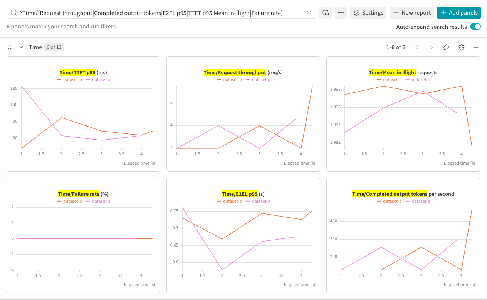
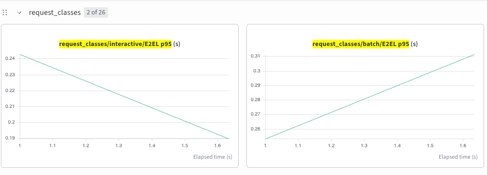
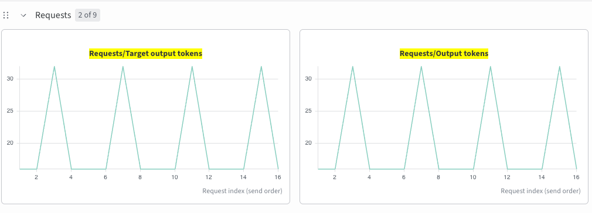

# Multiple datasets

English | [简体中文](multi-dataset_zh.md) · [Performance examples](README.md)

After [setup](README.md#setup), separate dataset selectors with commas:

```bash
foretoken perf examples/quickstart \
  --dataset r0b0tlab/qwen3.8-max-distillation-50k:train,ianncity/GLM-5.2-Conversation:train \
  --max-concurrency 4 --num-prompts 20 --output local,wandb
```

Datasets share one arrival clock, concurrency limit, and request budget. `--num-prompts` is divided evenly by default; use `--dataset-weights 3,1` with two datasets to allocate three quarters to the first. With `--duration` instead of `--num-prompts`, weights select conversations, each of which runs its selected turns. Each request keeps its source identity. With a request budget, the final multi-turn conversation is truncated to its source's remaining allocation. Local JSONL paths can replace remote selectors. Random inputs cannot be mixed with other datasets.

JSONL and Hugging Face rows can set `model`, `priority` (integer), `request_class` (benchmark label), and a positive integer `output_length`. For example, `{"prompt":"Hello","model":"Qwen/Qwen3-0.6B","request_class":"interactive","output_length":32}` sends that model and requests exactly 32 output tokens using `min_tokens` and `ignore_eos`; a reported token count different from 32 fails the request. Without `model`, the service selection applies. Rows with `model` can supply it instead of `--model` for URL or multi-model deployment workloads. `priority` is sent to the service and requires its priority-scheduling support; `request_class` labels requests for result breakdowns.

The console, local `metrics.json`, and W&B show dataset, model, and request-class breakdowns; per-request labels and target/actual output lengths are in `raw_output.json` and W&B's request table. Group throughput and goodput use the shared experiment duration, not each group's active interval. Multi-dataset workloads also work in HTTP sweeps and SLO searches. To compare different SLO targets for the same mixed workload, pass multiple criteria objects to `--slo-params`; each runs an independent search over the whole workload.

## Example output

A short run over two local datasets:




Request-class p95 latency from a 3:1 interactive/batch workload against an existing endpoint:



The same workload requests 16 or 32 output tokens per dataset row; target and actual counts line up in send order:


