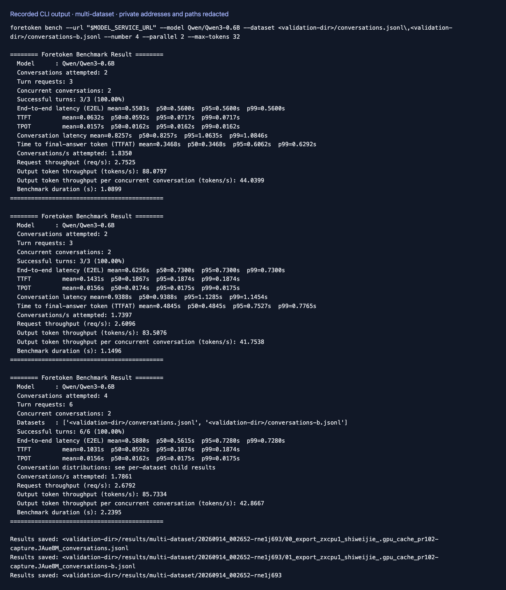
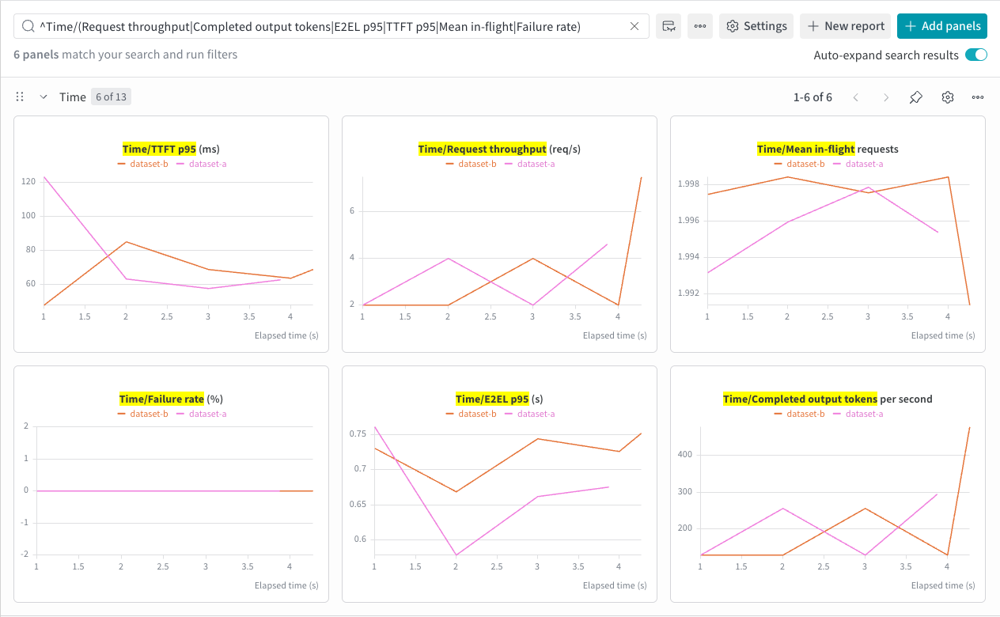
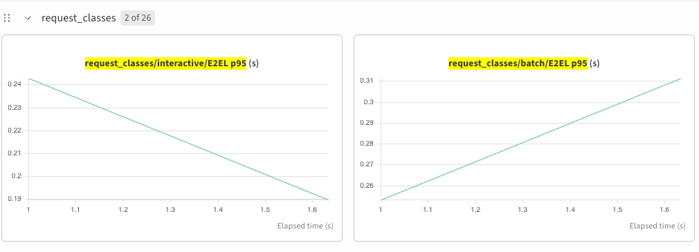
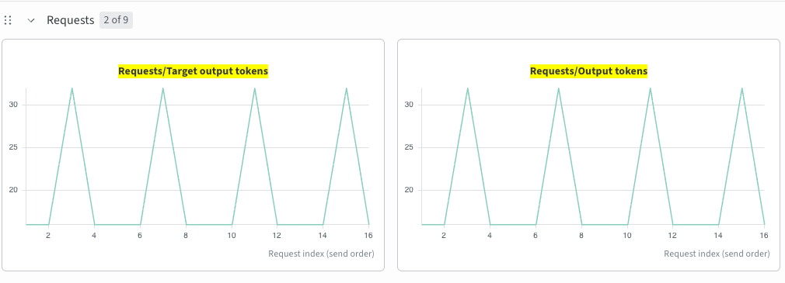

# 多数据集

[English](multi-dataset.md) | 简体中文 · [性能评测示例](README_zh.md)

完成[准备步骤](README_zh.md#准备)后，用逗号分隔数据集：

```bash
foretoken perf examples/quickstart \
  --dataset r0b0tlab/qwen3.8-max-distillation-50k:train,ianncity/GLM-5.2-Conversation:train \
  --max-concurrency 4 --num-prompts 20 --output local,wandb
```

多个数据集共用所设定的到达率、并发上限和请求预算。`--num-prompts` 默认平均分配；指定 `--dataset-weights 3,1` 时，第一个数据集获得四分之三的配额。仅使用 `--duration` 时，则按权重抽取对话。各数据集的请求预算用尽后，其多轮对话会停止。

远程数据集也可换成本地 JSONL 文件或 JSON 对话数组。随机输入需单独使用。

JSONL 中的整数 token 数组，例如 `{"prompt":[1,42,73],"output_length":32}`，作为一条已分词的 Completions 请求发送，不拆成多轮，也不添加聊天模板。token ID 必须使用被测模型的 tokenizer。字符串 `prompt` 仍按 Chat Completions 消息发送。有文本参考答案的轮次使用对应请求模型的 tokenizer 确定输出目标，详见[对话输出长度](conversations_zh.md)。

JSONL 和 Hugging Face 数据行可以指定 `model`、整数 `priority`、评测标签 `request_class` 和正整数 `output_length`。例如 `{"prompt":"你好","model":"Qwen/Qwen3-0.6B","request_class":"interactive","output_length":32}` 会选择该模型，并请求恰好输出 32 个 token。省略 `model` 则沿用服务选择；URL 或多模型部署的数据行都指定模型时，无需额外传 `--model`。`priority` 会传给服务端，需要服务支持优先级调度；`request_class` 是结果分组标签。

结果按数据集、模型和请求类别分组，各组的吞吐与 goodput 均以整个实验时长计算。比较负载设置见[参数扫描](sweep_zh.md)，寻找满足目标的并发见 [SLO 搜索](slo_zh.md)。

## 输出示例

以下为两个本地数据集的小规模运行：





下面是对已有服务发送 3:1 交互式/批量负载时，按请求类别展示的 p95 端到端耗时：



同一负载按数据行分别请求 16 或 32 个输出 token，目标与实际数量按发送顺序逐条对应：


