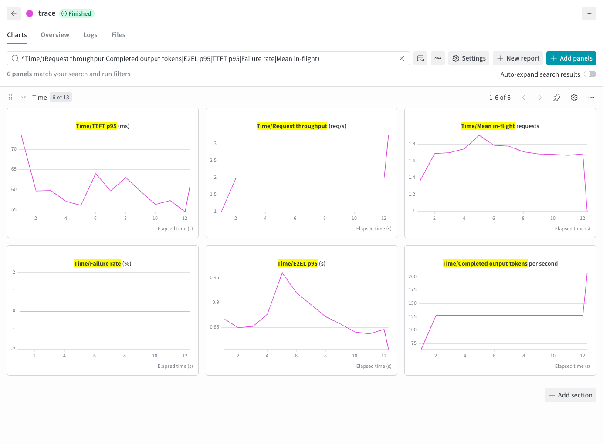

# StudyChat 轨迹回放

[English](studychat.md) | 简体中文 · [性能评测示例](README_zh.md)

完成[准备步骤](README_zh.md#准备)后，选择公开轨迹中一段有请求的短窗口：

```bash
foretoken perf examples/quickstart \
  --trace KrisQ/StudyChat --dataset KrisQ/StudyChat \
  --trace-start 18609050.546s --trace-duration 8min \
  --max-concurrency 16 --max-tokens 4096 \
  --output local,wandb,plot
```

`--trace` 提供到达时间，`--dataset` 提供内容。选择同一来源时直接使用各记录的消息。起点偏移相对于数据集中最早的时间戳，记录之间可能有很长的空档；此命令只回放所选的 8 分钟，不会先等待一千八百多万秒。窗口选中的请求可能在窗口结束后排空，并发等待计入回放延迟。

每条 trace 记录独立执行，不表示有因果关系的多轮对话。请求数量和到达时间由窗口决定，不添加 `--num-prompts`、`--request-rate` 或正数 `--max-turns`。在途请求数由 `--max-concurrency` 控制。

## 输出示例


