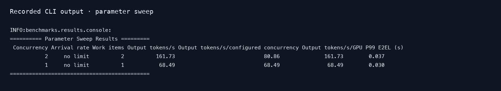

# Parameter sweeps

English | [简体中文](sweep_zh.md) · [Performance examples](README.md)

After [setup](README.md#setup), compare concurrency levels with the existing [parameter file](../../examples/sweep.jsonl):

```bash
foretoken perf examples/quickstart \
  --dataset random --tokenizer-path Qwen/Qwen3-0.6B \
  --min-prompt-length 128 --max-prompt-length 256 --random-seed 0 \
  --temperature 0 \
  --sweep benchmarks/examples/sweep.jsonl \
  --warmup-requests 16 --num-runs 3 \
  --output local,wandb
```

This runs 384 requests at concurrency 1, 2 and 4, requesting 256 output tokens each. Every point is repeated three times, with 16 warmup conversations before each repetition. Pass a deployment configuration directory such as `examples/quickstart`; sweeps support multi-turn, multi-dataset, and timestamp-trace workloads with their normal scheduling semantics.

Each JSONL row defines load, generation, or dataset settings. Lists of values for `max_concurrency`, `num_prompts`, `request_rate`, `arrival_pattern`, `burstiness`, `duration`, `warmup_requests`, and `conversation_history` expand into all combinations. SLO criteria may be included with a sweep; each point then runs its own SLO search.

To compare video-generation settings:

```bash
foretoken perf video \
  --url http://127.0.0.1:8091/v1/videos/sync \
  --dataset VideoArgusBench/TI2V \
  --sweep benchmarks/examples/video-sweep.jsonl \
  --num-runs 2 --output local,wandb
```

Video sweep points may vary `width`, `height`, `num_frames`, `fps`, `num_inference_steps`, `aspect_ratio`, `flow_shift`, `audio_flow_shift`, `seed`, `max_concurrency`, `duration`, and `warmup_requests`. Each point retains its generated videos and video-performance metrics.

## Read results

Open `sweep_summary.csv` in the printed result directory to compare repetitions. Individual results remain in each run's directory; [Result metrics](../../metrics.md#experiment-records) explains the saved files, statistics and units. Use `--experiment-name` to choose a fresh directory name, or omit it for an automatic name.

## Compare inference configurations

Change the model's [inference parameters](../../../docs/inference-parameters.md) and apply each configuration before repeating the same sweep:

```bash
foretoken deploy examples/quickstart --timeout 20m
```

`perf` reuses existing services without applying YAML changes. Keep the workload, hardware and cache policy consistent; append `--experiment-name baseline --wandb-group comparison` to the benchmark command, changing the experiment name for each variant. When finished, remove the explicitly deployed service with `foretoken delete examples/quickstart`.

## Example output

Example measurement for Qwen3-0.6B on an NVIDIA GPU:



W&B shows E2EL p95 in one-second completion windows; the Pareto plot compares whole-run output tok/s per user and per declared GPU. Points without either denominator are omitted.
