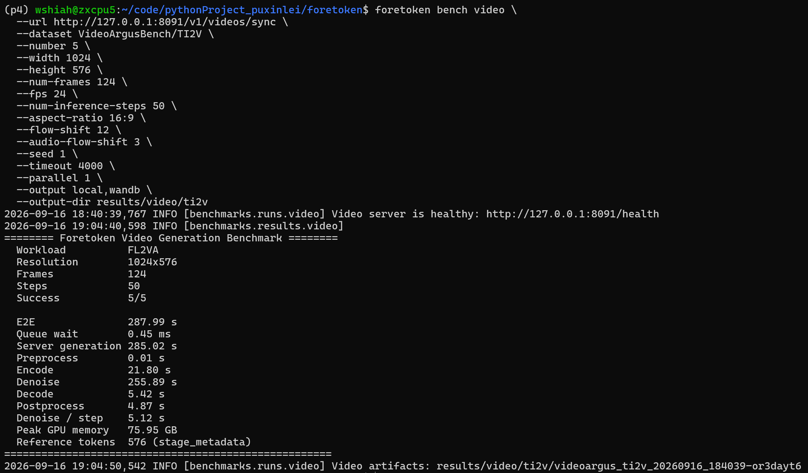
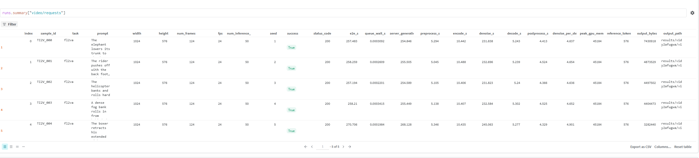
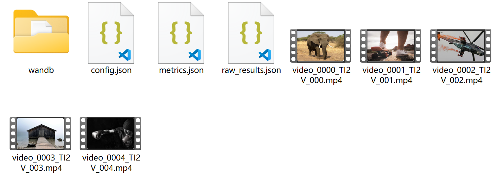
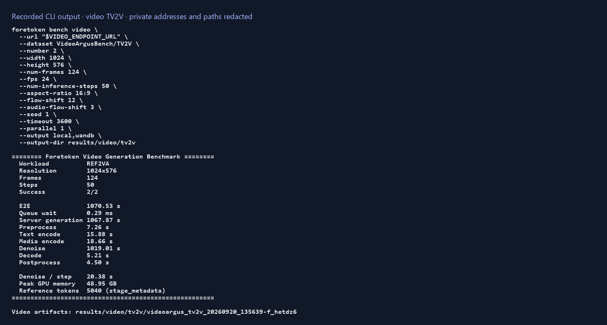
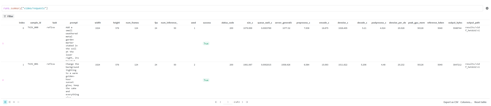
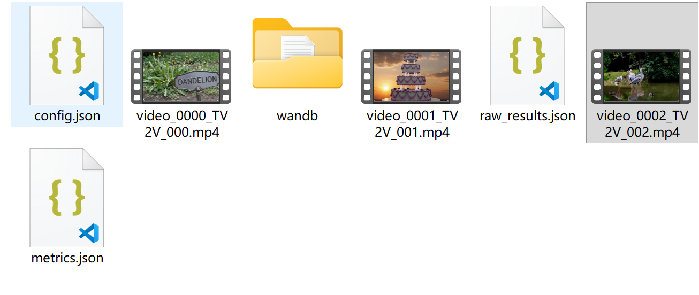

# Video generation

English | [简体中文](video_zh.md) · [Performance examples](README.md)

Run the benchmark from the repository root against an existing synchronous video-generation endpoint. The benchmark checks `/health` on the same server first; use `--health-url` if its public health endpoint is elsewhere.

## VideoArgusBench datasets

| Dataset selector | Endpoint task |
| --- | --- |
| `VideoArgusBench/T2V` | `t2va` |
| `VideoArgusBench/TI2V` | `fl2va` |
| `VideoArgusBench/TS2V` | `ref2va` |
| `VideoArgusBench/TV2V` | `ref2va` |
| `VideoArgusBench/TSV2V` | `ref2va` |

## TI2V benchmark

```bash
foretoken perf video \
  --url http://127.0.0.1:8091/v1/videos/sync \
  --dataset VideoArgusBench/TI2V \
  --num-prompts 10 \
  --width 1024 \
  --height 576 \
  --num-frames 124 \
  --fps 24 \
  --num-inference-steps 50 \
  --aspect-ratio 16:9 \
  --flow-shift 12 \
  --audio-flow-shift 3 \
  --seed 1 \
  --timeout 1h \
  --max-concurrency 1 \
  --output local,wandb \
  --output-dir results/video/ti2v
```

Generated videos are saved under `--output-dir`. Use `--warmup-requests N` to run N requests before measurement, or `--duration 5min` to send requests for up to five minutes; requests already sent are allowed to finish. To compare generation and load settings, add `--sweep benchmarks/examples/video-sweep.jsonl`.







## TV2V benchmark

```bash
foretoken perf video \
  --url http://127.0.0.1:8091/v1/videos/sync \
  --dataset VideoArgusBench/TV2V \
  --num-prompts 10 \
  --width 1024 \
  --height 576 \
  --num-frames 124 \
  --fps 24 \
  --num-inference-steps 50 \
  --aspect-ratio 16:9 \
  --flow-shift 12 \
  --audio-flow-shift 3 \
  --seed 1 \
  --timeout 1h \
  --max-concurrency 1 \
  --output local,wandb \
  --output-dir results/video/tv2v
```






