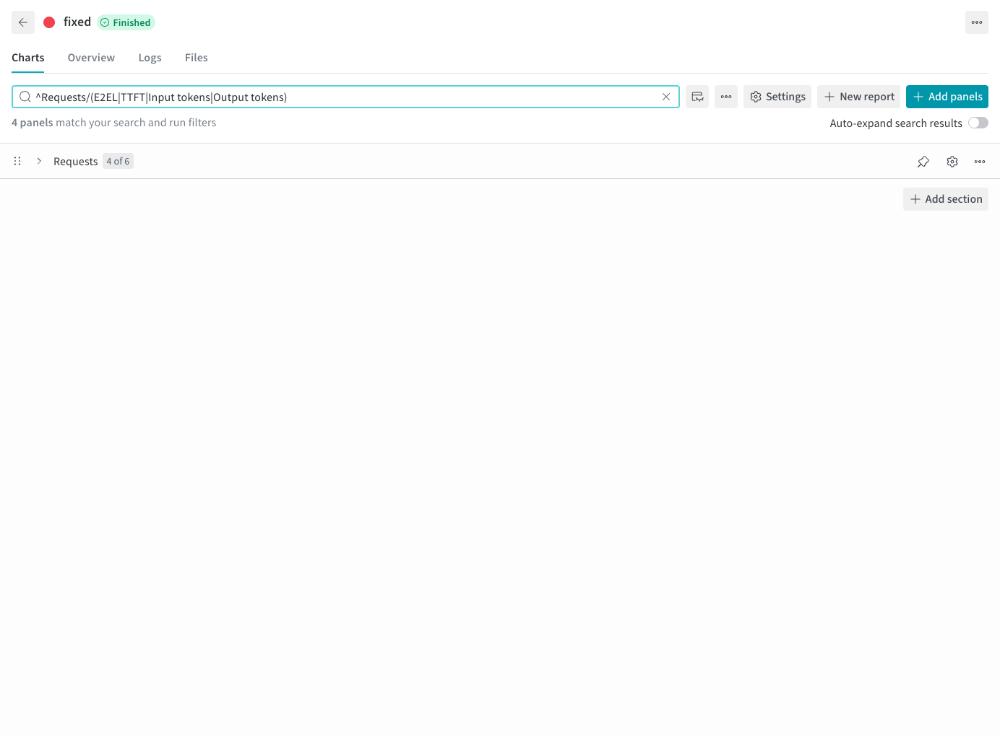

# W&B output

English | [简体中文](wandb_zh.md) · [Performance examples](README.md)

After [setup](README.md#setup), choose the project, group, and run name:

```bash
foretoken perf examples/quickstart \
  --num-prompts 20 --output local,wandb \
  --wandb-project foretoken-bench \
  --wandb-group qwen-comparison \
  --wandb-run-name quickstart
```

`--wandb-entity` selects the account or team. Group and run name are independent. Sweeps and multi-dataset runs generate a group if none is supplied; child labels are appended to their run names. Single runs are ungrouped by default.

The W&B page shows final aggregate metrics, P50/P95/P99 percentile metrics, and time-based, cumulative, and per-request series. When `--warmup-requests` is set, a separate Warmup section shows warmup request curves and a warmup-versus-measurement comparison; warmup remains outside formal performance metrics. Mixed workloads add dataset, model, and request-class breakdown tables and time curves on the same elapsed-time axis, plus a request table with labels and target/actual output tokens. Kustomize runs also show replica-count changes and, when the controller status can be sampled for the full benchmark window, allocated GPU-seconds and GPU-hours by device resource name. Coverage is shown separately; partial samples remain diagnostic and are not presented as total cost. Open a group's Workspace to compare runs; Summary retains the final values. See [Result metrics](../metrics.md#curves) for window definitions.

With a Kustomize model service and Prometheus, speculative-decoding runs also show [acceptance and stage-time observations](../metrics.md#speculative-decoding-observations). Sweep comparison runs plot the same measured-window summaries.



Choose destinations with the shared [output settings](../../README.md#read-and-save-results). When W&B is explicitly selected, an initialization, publication, or finalization failure makes the command fail and preserves any artifacts already produced.
