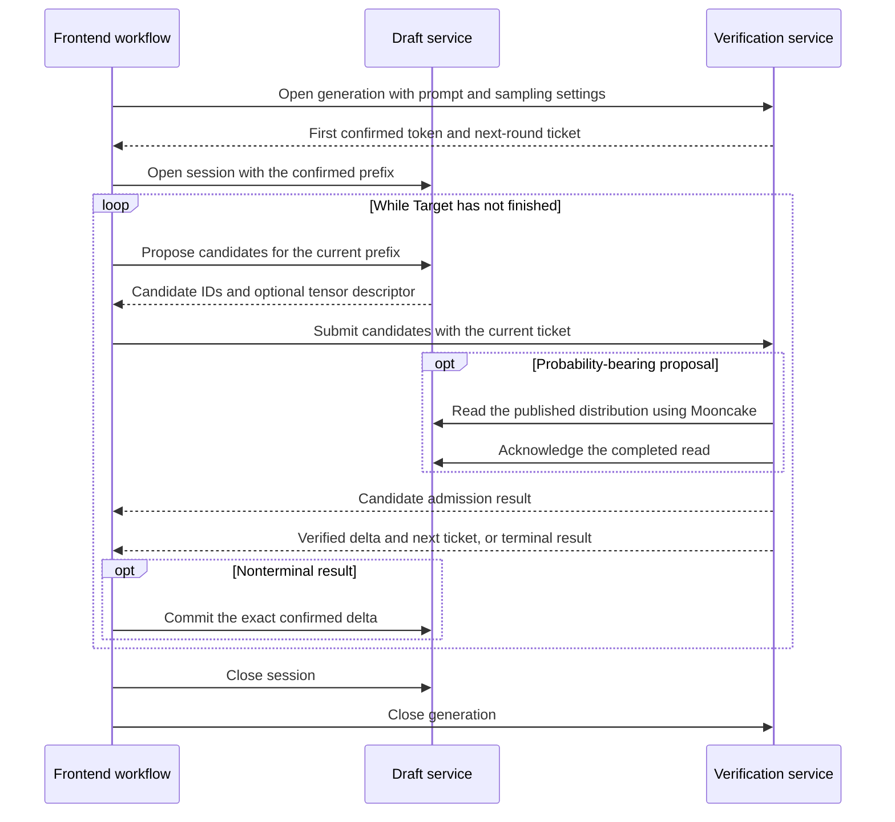

<!--
SPDX-License-Identifier: Apache-2.0
SPDX-FileCopyrightText: Copyright contributors to the Foretoken project
-->

# [RFC] Draft/Target disaggregation for speculative decoding

Status: proposed for review. Implementation: [PR #199](https://github.com/shiweijiezero/foretoken/pull/199).

## Motivation: let Draft and Target use independently provisioned resources

In ordinary autoregressive generation, the main model computes each next token.
Speculative decoding introduces a Draft model that proposes several tokens at
once. The main model, called Target in this algorithm, evaluates those candidates
and decides which tokens to keep. When it accepts several candidates, one Target
verification pass advances the output by several tokens.

In a co-located deployment, the inference engine runs Draft alongside Target and
coordinates this loop internally. This is convenient, but couples their resource
allocation. Draft and Target can have very different memory and compute needs,
and the capacity required for drafting need not grow at the same rate as the
capacity required for verification.

We propose making Draft independently deployable. Users choose both models,
place their instances on separate GPUs or hosts, and provision the two pools
separately. Foretoken coordinates the requests between them while retaining its
existing completion and chat APIs. Target remains the only authority that can
confirm output; moving Draft elsewhere must not change that responsibility.

This gives us independent placement and replica counts, removes Draft execution
from Target's GPU, and establishes a service boundary for later multi-Draft
algorithms. It does not establish a performance improvement by itself. A remote
Draft adds communication and coordination costs, which must be measured against
the Target work saved by accepting multiple candidates.

**NVIDIA and MetaX (MACA) are both required delivery platforms.** The current
implementation has NVIDIA execution evidence. MetaX engine adaptation and
validation remain part of the required work, not an optional later feature.

## Proposed service and architecture

The delivery consists of a standalone vLLM plugin and its Foretoken integration.
The plugin exposes Draft and verification services that can be driven directly
without Foretoken. Foretoken adds deployment, discovery, instance selection and
the request workflow that connects those services to its public APIs.


### Keep deployment stages separate from algorithm responsibilities

Aggregate, Prefill and Decode describe where a model's execution stages run.
Draft and Target describe what a model does in speculative decoding. These are
different decisions: a model can execute both prefill and decode as an Aggregate
instance while acting as either Draft or Target.

Consequently, phase one uses existing Aggregate pools. `spec.model` selects the
main model. `spec.speculation.draftPool` names the pool that proposes candidates,
and that pool's `model` selects its Draft weights:

```yaml
spec:
  model: Qwen/Qwen3-4B
  source: hf
  backend: vllm
  speculation:
    draftPool: draft
  modelPools:
    - name: draft
      role: aggregate
      model: Qwen/Qwen3-0.6B
      replicas: 1
      # GPU and memory requests omitted here.
    - name: main
      role: aggregate
      replicas: 1
      # GPU and memory requests omitted here.
```

The controller derives each pool's internal speculation responsibility from this
relationship. There is no new public `target` deployment role. The
[maintained example](../../examples/draft-target/model.yaml) supplies the resource
configuration omitted above. Without `speculation`, ordinary serving retains its
existing path.

The models may have different weights, but this implementation requires a common
tokenizer and compatible token-ID meanings. Draft's token `a` must mean the same
thing to Target. Equal vocabulary sizes alone do not establish that property;
this proposal does not include translation between tokenizers.

### Give placement, orchestration and batching different owners

Once the models are separated, three decisions must be made: which instances to
use, when to ask each instance to work, and which local requests to execute in a
GPU batch. Putting all three into one scheduler would mix cluster decisions with
engine-local state. We instead retain the existing owners:

| Component | Decision or state it owns | Input → output |
| --- | --- | --- |
| Controller | Pool capacity, rollout, model preparation and discovery | ModelService → independently managed instances |
| Router selection | Which eligible instance performs each responsibility | Request and candidate instances → one Draft and one verifier |
| Frontend DT workflow | Stage order and the lifetime of the bound pair | Prompt and selected instances → confirmed output stream |
| Draft service | Confirmed Draft context and outstanding proposal | Context and candidate budget → tokens and optional distribution descriptor |
| Verification service | Main-model request and candidate admission | Prompt or candidates → confirmed deltas and permission to start the next round |
| Each vLLM Scheduler | Local batch composition, preemption and KV allocation | Runnable requests and local resources → execution batch |
| Each Worker/ModelRunner | Device state, model inputs and sampling | Scheduled batch → proposal or verification result |
| DT Connector | Publication, transfer and lifetime of proposal tensors | Source tensor → destination tensor ready for verification |

The frontend workflow chooses the order of stages; the Router's
Filter–Scorer–Picker pipeline chooses their instances. The controller changes
capacity rather than advancing inference rounds. Each engine continues to batch
its own requests, using its own KV cache.

Phase one binds one Draft and one verifier for the lifetime of a request. More
Draft replicas increase service capacity; they do not combine their proposals
for a single request. This keeps the first execution path concrete without
introducing a general workflow engine before we need one.

## How one request runs

The easiest way to see the required changes is to follow a request through the
two services. Let `P` denote its confirmed token prefix. Both models may compute
speculative state, but only Target can extend `P`.


### Establish the prefix, propose candidates, and commit the result

The frontend first opens generation on Target with the prompt and sampling
settings. Target performs prefill and produces the first token without Draft.
If generation has not finished, the frontend opens a Draft session containing
the prompt plus that confirmed token. Both sides now refer to the same prefix.

Draft generates candidates, for example `[a,b,c]`. The frontend submits them to
Target. Target evaluates the candidates against the main model and applies native
rejection sampling. Suppose it accepts `a`, rejects `b`, and samples replacement
`x`. The confirmed delta is then `[a,x]`. The next Draft context must be
`P+[a,x]`; neither the rejected `b` nor the unverified `c` belongs in it.

The frontend therefore sends the exact confirmed delta back to Draft before
requesting another proposal. If all candidates are accepted, Target can also
produce an additional main-model token, subject to the request's stop and length
limits. The process ends when Target reports a terminal result.



The client receives only Target-confirmed output. The frontend passes token IDs
back to Draft rather than re-tokenizing displayed text, because stop-string
handling can crop text at boundaries that differ from model token boundaries.
The same rule applies to streaming and non-streaming requests.

### Identify the round before accepting a remote proposal

With an in-process Draft, the engine directly controls when candidates are
produced and consumed. With a remote Draft, candidates can arrive after the
Target request has been cancelled, preempted or advanced. Target needs to check
that the candidates still belong to its current request state.

The plugin supplies a ticket after each nonterminal output. It pairs vLLM's
internal request ID with the cumulative count of confirmed output tokens. The
role session exposes the generation frontier as `version` and maps it back to
the engine ticket when submitting a proposal. This version identifies the round;
it is neither a KV-cache length nor a transfer-buffer ID.

The engine-facing interface is:

```text
ExternalDraftRequest(request_id, generation)
RequestOutput.external_draft_request -> ticket, or None on terminal output
await ExternalAsyncLLM.submit_external_draft_tokens(ticket, token_ids) -> admitted
```

Submission succeeds only when the request is alive, waiting for candidates and
still at that generation. It also checks candidate length and token IDs. The
first successful submission consumes the waiting state, so a duplicate cannot
schedule the same round again. `admitted` means that verification may run; it
says nothing yet about which candidate tokens will be accepted.

Native preemption clears the waiting state before releasing KV and replaying the
request. Candidates cannot be admitted against that old waiting state. Replay
must advance the output frontier before another ticket is used. The workflow
does not silently move a rejected proposal to a different generation or instance.

### Let other requests run while one waits for Draft

A Target waiting for network input still owns a request and may hold KV blocks,
but it has no model work ready to execute. Treating that wait as a blocking call
inside ModelRunner would stall unrelated requests in the engine.

The plugin instead records waiting state in the Scheduler. Such requests remain
in native request state and remain eligible for KV preemption, but are excluded
from execution until candidates arrive. Candidate submission uses EngineCore's
existing utility queue to make the request runnable. EngineCore sleeps when only
remote waiters remain; it continues scheduling any other ready work.

This is asynchronous network admission, not vLLM's optional async-scheduling
mode. The current adapter uses synchronous local scheduling, one GPU worker per
instance, eager execution and output interval one.

### Keep batching and KV local to each engine

Different requests can become ready in different orders on Draft and Target.
A row in a Draft batch therefore cannot identify the corresponding row in a
Target batch. The adapter associates candidates with request IDs and generations,
then resolves their current Target slots when constructing the execution batch.

Both engines keep native KV allocation and local batching. There is no shared KV
allocator, and this implementation transfers no KV between the models. Different
weights generally produce different cached state even for the same token prefix.

Draft currently starts an ordinary vLLM request for each proposal round using the
confirmed prefix. Native automatic prefix caching can reuse computed blocks.
Unaccepted guesses are excluded by constructing the next request from confirmed
tokens, rather than by implementing a separate Draft KV rollback system. This
reuses existing engine behavior, but leaves request setup and partial-prefix
recomputation as potential costs.

## What the Connector transfers, and why

### Random verification needs more than candidate token IDs

For greedy decoding, Target can check proposed token IDs against its own choices.
For stochastic speculative decoding, correct rejection sampling also depends on
the distribution that Draft actually sampled. If `p` is Target's distribution and
`q` is Draft's, accepting a candidate depends on their probability ratio; sampling
a replacement after rejection needs the residual distribution proportional to
`max(p-q,0)`. The probability of the selected token alone is insufficient.

Draft therefore exports complete normalized float32 `log(q)` rows with shape
`[candidate_count, vocabulary_size]`. These rows describe the distribution after
Draft temperature and supported truncation. They are not raw model logits. For
a greedy Draft draw, the row is zero at the chosen token and negative infinity
elsewhere.

The frontend should not copy this matrix through its HTTP process. It relays the
candidate IDs and a descriptor, while Target's Worker reads the matrix directly
from Draft's Worker through Mooncake:

| Path | Information carried | Consumer |
| --- | --- | --- |
| Frontend → Draft | Confirmed prefix or delta, version, sampling and budget | Draft session and engine request |
| Draft → frontend → Target | Candidate IDs, version, artifact ID and `PayloadRef` | Target admission and transfer setup |
| Draft Worker → Target Worker | Full proposal `log(q)` matrix | Native rejection sampler |
| Target → Draft | Read ACK with exact publication ID | Source buffer owner |
| Target → frontend → Draft | Confirmed delta and next version | Public output and next Draft context |

`PayloadRef` contains `publication_id`, `segment`, `address`, `nbytes`, `dtype`
and `shape`. Target checks its layout and allocates its own destination tensor.
The artifact ID identifies the proposal's lifetime; the publication ID identifies
one immutable export of registered memory. Neither is a token-acceptance result.

After receiving the matrix, the adapter supplies `log(q) * target_temperature`
to the native sampler, whose temperature division recovers `log(q)`. Greedy
Target sampling uses unit scaling. This preserves the already processed Draft
distribution instead of applying a second temperature transformation to it.
Draft random draws remain independent of the Target RNG, so setting a Target
seed does not promise identical output across different proposal schedules.

Without RDMA, both roles advertise `greedy_token_ids` and accept temperature zero
only. With RDMA, both advertise `token_ids_log_probs`. The selected pair must
agree on this format; a probability-bearing request cannot silently fall back to
token-only verification.

### Separate transfer completion from model consumption

A source tensor must not be published before Draft's GPU finishes writing it.
It must then remain registered and immutable while Target reads it. Conversely,
Target must not schedule verification until its destination tensor is ready.
These dependencies require the Connector to own buffer lifetime as well as send
and receive operations.

The Worker records device events around local production and consumption. A
background transport event loop handles reads and release work outside model
execution. Target waits for read completion, ACKs the exact source publication,
stages the received artifact against the request ticket, and only then submits
the candidate IDs to EngineCore.

Three events have different meanings:

1. The **read ACK** permits Draft to release the source publication.
2. **Candidate admission** permits Target to schedule verification.
3. **Verification completion** permits release of the destination after its last
   local GPU use, and determines the committed tokens.

Cancelling an HTTP call does not establish that DMA has stopped. The read/ACK task
therefore survives cancellation of its caller, while stale tickets prevent later
inference admission. If transfer completion is uncertain, the buffers remain
retained rather than being reused while a peer might still access them. Such
resources can require process termination after a peer failure.

Once safe to reuse, a buffer returns to a Worker-owned pool keyed by exact tensor
shape. Registration persists across rounds, preserving remote registration keys.
This can retain peak concurrent storage for each shape until shutdown. Idle pooled
buffers are reusable and do not count as outstanding artifacts; an active or
uncertain transfer does.

## How Foretoken turns the two services into one public model

### Publish model identity, then select compatible instances

The controller uses the existing model-preparation and RuntimeCache machinery
for each pool's weights. Loading a prepared filesystem snapshot must not change
the identity advertised to discovery: the role preserves the configured model
and tokenizer identity and provides resolved tokenizer metadata to the frontend.

The serving snapshot keeps the public main model in `models` and publishes the
ready, committed role instances in `dt_components`. Each component identifies
its service, pool, route, pipeline scope, loaded `engine_model`, revision and
endpoint. This allows Draft to load different weights without appearing as an
independent public main model.

Registry probes check role, model/tokenizer identity, candidate format, context
limit and admission state. Router selection then chooses Target first and Draft
within the same service/pipeline scope. Both instances keep a request-load
reservation until completion, cancellation or failure. Invalid discovery updates
leave the active serving generation intact.

The DT path currently supplies no native scheduler queue-depth or KV-index
observations. Frontend reservations can guide placement, but missing engine
measurements must not be presented as zero load or cache hits. Independent pools
provide the deployment mechanism for scaling; a DT metric-driven autoscaling
policy is not delivered here.

### Preserve public request semantics through the DT workflow

The adapter accepts the existing normalized `GenerateRequest` and returns the
existing `TokenStream`. Tokenization, text/chat output processing, public request
identity and deadlines stay with the frontend. The workflow controls only the
proposal/verification loop and its remote session lifetimes.

Before opening sessions it checks that prompt plus requested output fits both
models' context limits. Each round's candidate budget is the minimum of the two
advertised budgets and the remaining output allowance. The current request
support is explicit:

| Request feature | Handling |
| --- | --- |
| Temperature, top-p, top-k and Target seed | Forwarded; random sampling requires distributions on both roles |
| EOS, stop tokens and min/max length | Forward the frontend-normalized token policy; disable independent Python EOS inference |
| Stop strings | Existing frontend decoder handles them; direct standalone role calls can separately use Python-side stop strings |
| Non-default penalties, min-p, logprobs and structured output | Rejected before role admission |
| Multimodal input, LoRA, KV/EC transfer options, cache salt, priority, tracing headers and nonzero DP rank | Rejected by this frontend DT path |

These checks apply after model generation defaults are resolved. For example,
a model default of `repetition_penalty: 1.1` remains unsupported even if the
client omits that field. Requesting `1.0` disables the penalty and changes the
sampling policy; it does not establish support for the original request.

### Make cancellation and drain follow session ownership

The returned stream owns both role lifetime streams across every await. Dropping
it cancels the paired sessions, including while Draft is producing a proposal.
Terminal output releases those owners before being yielded, so keeping an
exhausted stream object cannot keep remote requests alive. Client backpressure
does not launch detached proposal work.

If a role fails after streaming headers have been sent, an EOF without a terminal
commit is a failure. The frontend cancels the paired session rather than reporting
success or transparently replaying the request elsewhere. Migration and peer
restart recovery are not implemented.

Drain closes new admission but allows bound requests to finish. Health/readiness
remains available so Kubernetes does not remove the network path needed by those
requests. Discovery excludes drained replicas from subsequent selections after
refresh. The model-server supervisor waits for both active sessions and retained
artifacts within the shutdown deadline before terminating the process group.
Zero sessions alone does not prove that transfer memory is safe to release.

## Interfaces and implementation changes

The preceding mechanism determines the interfaces we need. Role APIs express
session operations; engine hooks express when a request can execute; Worker
hooks deal with tensors. This keeps routing out of vLLM and Mooncake details out
of EngineCore and Scheduler.

### Standalone role API

| Endpoint | Input | Output or state change |
| --- | --- | --- |
| `GET /status` | — | Model/tokenizer identity, context limit, format, budget, admission and resource counts |
| Target `POST /generate` | Prompt tokens, sampling, stop and length settings | NDJSON `opened` event followed by `committed` deltas |
| Draft `POST /sessions` | Confirmed prefix, version and sampling | `opened` event on a stream retained for the session lifetime |
| Draft `POST /sessions/{id}/propose` | Current version and budget | Version, candidate IDs and optional `{artifact_id, payload}` |
| Target `POST /sessions/{id}/verify` | Version, candidates, artifact and Draft source endpoint | Admission result; verification output follows on the generation stream |
| Draft `POST /sessions/{id}/commit` | Base version, new version and exact confirmed delta | Advance Draft context without retaining rejected guesses |
| `DELETE /sessions/{id}` | Session identity | Idempotent cancellation |
| `POST /drain` | — | Reject new sessions while existing sessions finish |

A committed event carries token/text deltas, finish/stop information, cached-token
count and the next version, which is null on termination. Each Draft session
allows one outstanding proposal. Conflicting context updates return 409, unknown
sessions 404 and malformed requests 422. Failed engine health makes status and
new admission unavailable. Empty candidates request one ordinary Target step;
this facility is not automatic recovery from a failed Draft.

Controller integration additionally uses `/healthz`, `/readyz`,
`POST /v1/internal/admission/close` and `GET /v1/internal/telemetry`. Telemetry
counts owned sessions as `running_requests`; native scheduler/KV gauges and token
counters remain unknown. `/status.retained_artifacts` separately exposes transport
ownership for the supervisor's drain decision.

### vLLM adapter: reuse execution, add external candidate admission

The current adapter targets native vLLM `0.30.1rc1.dev194+g3b4566c5c`. It is an
installable `foretoken_dt` package registered through `vllm.general_plugins`.
Native class-selection interfaces choose plugin subclasses where available;
missing EngineCore and Runner entry points use small process-local runtime hooks.
Installed vLLM source files are not edited by the standalone plugin, but these
internal interfaces remain version-sensitive.

| Integration point | Native behavior retained | Required addition |
| --- | --- | --- |
| AsyncLLM | Request processing, output, stop handling and abort | Retain internal request ID and attach nonterminal tickets |
| EngineCore | Process lifecycle and utility queue | Accept external submissions; sleep when only remote waiters remain |
| Scheduler | Batching, KV allocation and preemption | Waiting eligibility, ticket checks and candidate-generation metadata |
| Worker / MRV2 | Device lifecycle, model inputs and forward execution | Place externally supplied candidates in the current request slots |
| Sampler | Native sampling and rejection algorithm | Export actual Draft distributions and consume received distributions |
| Worker extension | Device-local work | Own Mooncake registrations, reads, staging and safe release |

MRV2 means ModelRunner v2, below EngineCore, Executor and Worker. It does not
replace EngineCore. In particular, updating Scheduler's CPU candidate list is
insufficient: MRV2 input preparation reads `req_states.draft_tokens`. The adapter
fills that GPU state after request-slot updates and before input preparation.
During sampling it supplies the distribution associated with those same slots.

Target selects `method="external"` and constructs no local Draft model or
speculator. On the remote Draft, each per-round request carries
`SamplingParams.extra_args["dt_artifact_id"]`. The sampler selects its materialized
processed-logit path, allowing the Worker to capture the actual sampling
distribution without copying the whole matrix to the API process.
`DraftTargetWorkerExtension` connects these operations through the native
`worker_extension_cls` interface.

The AsyncLLM wrapper retains the internal ID from the native output collector and
adds tickets after stop handling, avoiding a change to vLLM's cross-process output
schema. Scoped Runner/speculator/sampler factory substitutions are restored after
construction or loading. No native scheduling or forward-execution method body
is copied. These choices keep the adaptation small, while still requiring an
engine-interface review when upgrading versions.

### Foretoken integration and packaging

| Area | Change | Existing facility reused |
| --- | --- | --- |
| ModelService/Pool | Draft-pool reference, separate weights and derived speculation responsibility | Validation, normalization and pool reconciliation |
| ModelGroup | Launch the appropriate role and configure same-service RDMA connectivity when allocated | Deployment, NetworkPolicy, readiness and drain |
| Model preparation | Load each pool's prepared snapshots and preserve discovery identity | Preparation and RuntimeCache |
| Model-server | Supervise the installed role application and its transfer-aware drain | Launch argument renderer and process-group lifecycle |
| Registry and Router | Discover compatible pairs and reserve both selected instances | Serving snapshots, health refresh and Filter–Scorer–Picker |
| Frontend workflow | Advance rounds and propagate cancellation | Public API dispatch and output processing |
| Images | Install the DT package with the platform-compatible engine and Mooncake | Existing runtime and model-server builds |

The role entry point is `foretoken-dt-role --role draft|target`; it inherits model
and tokenizer arguments from vLLM. The candidate budget defaults to three, and
`--rdma-host` enables the probability transport. Installing the package does not
install an engine or register another `vllm serve` mode. The model-server image
installs it into the engine's Python environment, and the launcher extends an
inherited `VLLM_PLUGINS` allowlist so subprocesses load the hooks.

The production image also retains Foretoken's existing profiling, readiness and
offload backports. Those are separate from the standalone DT hooks: an
unchanged-wheel check in standalone testing does not describe an unpatched
production image. Rust build sources and installed Python engines are pinned
independently. Ordinary serving uses its existing execution path when DT is not
configured.

## Deliver the same mechanism on NVIDIA and MetaX

The session protocol, ticket rules and frontend workflow do not depend on an
accelerator vendor. Device initialization, model execution kernels and registered
memory do. Platform differences therefore belong in the engine adapter and
runtime build, while the common request and Connector ownership contracts remain
the same.

The repository already has a
[MetaX runtime build](../../deploy/inference-engines/vllm-metax/Dockerfile), including
Mooncake built with `USE_MACA=ON` and `MC_MACA_HOST_TRANSPORT=1`. We should reuse it,
not install a CUDA Mooncake wheel into MACA. However, its
[pinned environment](../../deploy/inference-engines/vllm-metax/source-environment.json)
uses core vLLM `0.30.0.dev0` and vLLM-MetaX `0.29.0.dev0`. The current DT adapter
accepts a different exact vLLM version, so it cannot yet start on this runtime.
Removing the version check would hide the mismatch rather than resolve it.

The remaining MetaX work follows the same execution path described above:

1. Inspect the platform-selected Worker/Runner and integrate candidate admission
   and verification without bypassing MetaX device or attention initialization.
2. Adapt the sampling hooks so exported `q` is the distribution actually sampled,
   and received distributions reach the supported rejection implementation.
3. Verify MACA device events, tensor registration and Mooncake read completion,
   including cancellation and buffer reuse on two hosts.
4. Package the adapter in the existing MetaX image and run it through Foretoken's
   selection, streaming and drain paths.

Matching interfaces should share code; necessary platform/version adaptations
should remain local to the engine integration. CUDA-compatible Torch API names
alone do not demonstrate compatible memory-registration or event semantics.

The current launcher defaults NVIDIA-oriented batch-invariant execution on.
MetaX needs a supported numerical configuration rather than inheriting that
assumption. Each platform's greedy comparison must use matched numerical settings;
random-request completion alone does not establish distribution equivalence.
Mixed-vendor Draft/Target pairs require additional evidence beyond running the
homogeneous NVIDIA and MetaX pairs.

## Scope, follow-up work and acceptance

The first delivery covers text and linear candidates, with one Draft and one
verifier per request, on both required platforms. Each instance initially uses
one eager GPU worker and synchronous local scheduling. Independent replicas are
supported by the architecture; transparent session migration and a new
autoscaling policy are not part of this delivery.

Future methods need specific extensions rather than additional endpoint names.
PD composition would place verification at Decode and requires main-model state
handoff plus Draft context preparation. The internal route representation must
also separate execution stage from speculation responsibility before that
composition is enabled. Multimodal input additionally needs a defined way for
Draft to consume the conditioned context.

For multiple Drafts or `Draft1 → Draft2 → Target`, the frontend workflow would
select and advance more participants. A tree verifier needs branch topology,
tree attention and accepted-path cleanup; an intermediate verifier must define
the proposal distribution it produces. It cannot acquire final commitment
authority simply by being another stage. KV sharing, offload and migration
likewise need model/layout and ownership contracts beyond the current tensor
transport. None of these extensions is implemented by phase one.

Functional acceptance proceeds from standalone roles to Foretoken integration.
For each platform, direct plugin validation must exercise multi-round generation,
actual cross-host probability transfer, waiting/resume, concurrency, cancellation
and resource release. Integrated validation must then exercise public output,
compatible-pair selection, exclusion of ineligible replicas, drain and deployment
lifecycle using the packaged image. Merely starting two services or transferring
a test tensor is insufficient.

Existing NVIDIA evidence includes two-host A100/Mooncake execution, greedy parity
against the empty-candidate Target path, stochastic-request completion and cleanup.
The production frontend has exercised public streaming, multiple Draft replicas,
ineligible-node exclusion and drain through static discovery. A Kubernetes run
on 2026-09-29 exercised controller-created pools and DT → Aggregate → DT rollout
on two local GPUs without RDMA. Ordinary Aggregate generation also ran in the
packaged image.

Those results predate the latest main-branch model-preparation integration. The
merge passed Rust workspace Clippy, Go generation/vet, Ruff and pre-commit checks;
its GPU/Kubernetes paths have not been rerun. MetaX DT execution and cross-host
acceptance remain outstanding. Kubernetes cross-node RDMA, uninterrupted scaling
under active traffic and stochastic distribution-equivalence validation are not
established by the existing evidence.

After functional acceptance, benefit experiments should compare matched APIs,
workloads, numerical settings and total GPU budgets. The present per-request loop
is sequential, so its approximate steady-state cost is:

```text
cost per confirmed token =
    (Draft time + transfer time + verification time + coordination time)
    / mean confirmed tokens per round
```

Measure those terms and acceptance behavior before selecting an optimization.
Independent GPUs alone do not overlap dependent rounds, and full-distribution
traffic or Draft prefix recomputation can erase the savings. This RFC makes no
speedup claim; baseline and performance experiments remain a subsequent task.

## References and implementation locations

- [vLLM RFC: Disaggregated Speculative Decoding with Standalone Parallel Draft Model](https://github.com/vllm-project/vllm/issues/42109).
- [Plugin and standalone launch instructions](../../data-plane/dt-plugin/README.md).
- [Model-server role supervisor](../../data-plane/model-server/src/draft_target.rs).
- [Router selection pipeline](../../data-plane/frontend/src/router/src/selection/pipeline_router.rs).
- [Frontend DT workflow](../../data-plane/frontend/src/server/src/draft_target.rs).
- [Foretoken deployment example](../../examples/draft-target/README.md).
