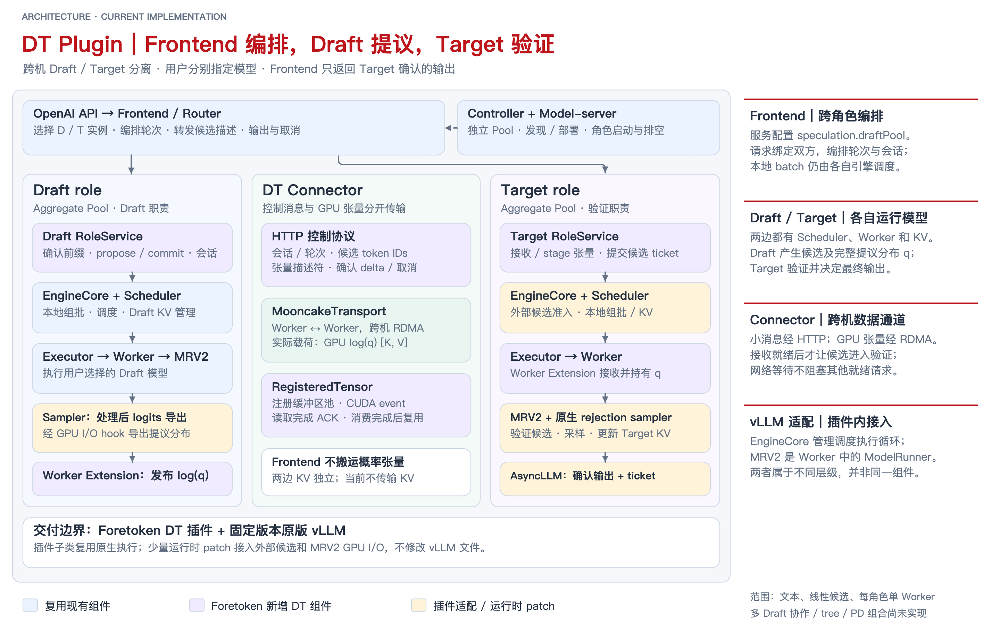

<!--
SPDX-License-Identifier: Apache-2.0
SPDX-FileCopyrightText: Copyright contributors to the Foretoken project
-->

# [Proposal] Independently deployable Draft/Target speculative decoding

Status: proposed for maintainer review, 2026-09-28. The prototype is
[Foretoken PR #199](https://github.com/shiweijiezero/foretoken/pull/199).
The native-vLLM adapter described below has been validated locally but is not yet
in that PR's published head. Implementation evidence does not imply design approval.

## 1. Motivation and deliverable

Allow users to choose compatible Draft and main models, place them on separate
GPUs or hosts, and scale their capacity independently. Draft produces proposals;
the main model verifies them and alone determines the returned tokens. Foretoken
retains its public generation APIs and existing deployment lifecycle. The engine
plugin must also work without Foretoken's controller, Router or Rust frontend.

Separating the models can remove Draft resource contention from Target GPUs and
allow several Target instances to use a shared Draft pool. It also provides a
boundary for later multi-Draft methods. These are hypotheses to measure, not an
established speedup. One request still binds one Draft and one Target in phase one;
adding replicas supplies capacity rather than combining proposals.

For a sequential round, time per confirmed token is approximately
`(draft + transfer + verification + coordination time) / confirmed tokens`.
Moving Draft to another GPU does not by itself overlap dependent rounds. The
prototype has one outstanding round per request; other requests can execute while
one waits. Extra GPUs, full proposal distributions and repeated Draft request
setup can outweigh the saved Target work.

Phase one delivers text generation with linear candidates, compatible token-ID
semantics, separate local KV caches, cross-host Mooncake transport, concurrency,
streaming, cancellation and drain. Each instance initially uses one GPU worker,
eager execution and synchronous local scheduling. Trees, cascades, PD composition,
multimodal input, KV transfer/offload and a new autoscaling policy are deferred.
No unused tree or workflow fields are added in anticipation of those features.

## 2. Roles and component ownership

A deployment stage and an algorithm responsibility are separate dimensions.

| Concept | Proposed meaning and phase-one mapping |
| --- | --- |
| Aggregate | An engine performs prefill and decoding. Both phase-one pools use this existing deployment role. |
| Prefill / Decode | Existing stages of the main model's PD execution. They retain their meanings. |
| Draft | A proposal-producing responsibility selected by `speculation.draftPool`; its pool loads the user's Draft model. It is not the Decode stage. |
| Target | The main model's final verification responsibility, not a new public deployment-role enum. Aggregate performs it initially. A future PD design would place iterative verification at Decode. |

The current configuration is represented by the maintained
[ModelService example](../../examples/draft-target/model.yaml): `spec.model`
selects the main model, `spec.speculation.draftPool` selects the Draft pool,
and that pool's `model` selects Draft weights. Both pools retain `role: aggregate`.
Without `speculation`, ordinary serving remains unchanged. Model identity and
candidate compatibility are checked before binding; matching vocabulary sizes
alone do not establish matching token meanings.

| Component | Inputs → outputs | Responsibility |
| --- | --- | --- |
| Existing controller | Desired pools and replicas → ready instance discovery | Deployment, capacity changes and drain; does not advance inference rounds. |
| Router selection | Request, ready compatible candidates and observations → bound instances | Filter, score and pick within each required participant set; retain request-load reservations. Does not run proposal/verification loops. |
| Frontend pipeline / DT workflow | Bound instances and request → confirmed output stream | Order stages, align Draft context, advance rounds and propagate cancellation. Own the paired sessions until completion. |
| Role services | Session operations → proposals or confirmed deltas | Translate the engine-neutral protocol to engine execution and coordinate transfer readiness. |
| Local engine Scheduler | Ready work, local KV and token budgets → execution batch | Batch and preempt locally. A remote waiter must not stop unrelated ready requests. |
| Worker / ModelRunner | Scheduled work and ready tensors → model and sampling results | Device ownership, tensor preparation and native forward/rejection sampling. MRV2 is the Runner, beneath EngineCore and Executor. |
| DT Connector | Tensor publication and destination storage → ready artifact | HTTP carries control/descriptors; Mooncake moves GPU proposal distributions directly between workers. |

The frontend pipeline owns **stage order**; selection algorithms own **which
instance executes a stage**. Phase one needs a fixed DT loop, not a generic DAG
scheduler or another control-plane service. Future `Draft1 → Draft2 → Target`
execution belongs in that frontend workflow boundary; an intermediate verifier
must not acquire the final Target's commitment authority.

## 3. Request interfaces and lifecycle

The plugin exposes internal role APIs independently of Foretoken. The exact wire
contract is maintained in the [role protocol](../../data-plane/dt-plugin/docs/role-protocol.md),
with buffer ownership in the [Connector contract](../../data-plane/dt-plugin/docs/connector-contract.md).

| Operation | Required information | Result / ownership |
| --- | --- | --- |
| Describe | Role endpoint | Model/tokenizer identity, context limit, candidate format, budget and admission state. |
| Open Target generation | Prompt tokens, sampling and stop/length settings | Owned stream; confirmed delta and next engine ticket. Initial prefill produces the first token without Draft. |
| Open / update Draft context | Confirmed prefix or exact confirmed delta, context version | Owned Draft session; unaccepted guesses never become committed context. |
| Propose | Current version and candidate budget | Candidate IDs and, for random sampling, a descriptor for full proposal `log(q)` rows. |
| Verify | Current ticket, candidate IDs and artifact source | Transfer readiness then engine admission. Admission success is distinct from token acceptance. Results arrive on the Target stream. |
| Close / drain | Session or role | Cancel owned work, reject new bindings during drain, and complete or safely retain outstanding transfers. |

Per request: Target prefill → Draft proposal → receive/stage distribution →
Target verification → confirmed delta → Draft context update → repeat. The
frontend streams only Target-confirmed output and never reconstructs token state
by re-tokenizing display text. Each side batches independently; batch row numbers
are not cross-service identities.

Tickets pair a unique engine request ID with its confirmed-output frontier;
clients treat them as opaque. Stale or consumed submissions do not advance the
request. Empty candidates request an ordinary Target step. Random rejection uses
the actual Draft sampling distribution, including its temperature and truncation,
not an assumed distribution inferred from candidate IDs.

Each engine owns its KV. Different models' KV is not interchangeable. The Draft
prototype issues ordinary per-round requests and reuses native prefix caching;
recomputation and request setup remain possible performance costs. Source buffers
remain owned until read acknowledgement; destination buffers remain owned until
verification completion or safe abort. Cancelling HTTP does not cancel DMA.
Disconnects close sessions; uncertain transfers can retain registered storage
until process termination. Transparent peer recovery and live session migration
are outside this phase.

## 4. Reuse, adaptation and the vLLM dependency decision

Reference designs include upstream
[RFC #42109](https://github.com/vllm-project/vllm/issues/42109) and its
[PoC snapshot](https://github.com/laviier/vllm/tree/2132e0599aba8dd252b6e1880547c6617b709a2c).
They inform remote proposal execution, N:M binding and connector boundaries.
Their verifier-side proxy/router and speculation-cache approach are not imported
as Foretoken's frontend orchestration, nor evidence that Foretoken has trees,
lookahead overlap or the reference author's reported performance.

| Facility | Reuse | Foretoken implementation / adaptation |
| --- | --- | --- |
| Foretoken deployment and discovery | ModelService, pools, committed serving snapshots, process supervision and drain | Publish Draft participation/model overrides; select compatible main and Draft instances. |
| Foretoken request handling | Normalization, tokenization, output streaming and request lifetime | DT stage loop and role clients; keep instance selection separate. |
| vLLM execution | EngineCore, local batching/KV, Worker, MRV2 forward execution and rejection sampling | External-candidate admission and readiness; map candidates and received `q` into current GPU request slots. |
| vLLM plugin facilities | `general_plugins`, `worker_cls`, `scheduler_cls`, `worker_extension_cls`, utility queue | Plugin subclasses and narrow runtime hooks where no native factory/interface exists. |
| Mooncake Transfer Engine | RDMA registration and transfer operations | Publication, completion and buffer ownership for DT artifacts; no Mooncake Store requirement. |

The earlier [vLLM PR #1](https://github.com/shiweijiezero/vllm/pull/1) added generic
external-candidate and distribution-I/O interfaces because native MRV2 did not
expose them. Those capabilities remain necessary; an extra source branch is not
the only way to supply them.

**Proposed delivery: keep the adapter in Foretoken and use an unmodified, fixed
native vLLM version.** The local prototype targets
`0.30.1rc1.dev194+g3b4566c5c` and uses:

- Plugin Scheduler and Worker classes through native class-selection interfaces.
- Two EngineCore hooks: candidate submission over the existing utility queue and
  work readiness while requests await proposals.
- Scoped factory substitutions for Runner, local-speculator suppression and the
  proposal-aware sampler. Bindings are restored after construction/loading.
- A plugin AsyncLLM wrapper for tickets, without changing the native interprocess
  output schema or copying upstream scheduling/execution method bodies.

This removes the fork dependency for the demonstrated scope, **not the dependence
on engine internals**. Maintainers must accept version-specific adapter upkeep.
The Rust build submodule is independent of the installed Python engine. NVIDIA
source builds select the supported native engine through the
[CUDA runtime build](../../deploy/inference-engines/vllm-cuda/Dockerfile) and
install the plugin distribution in the normal model-server image. Explicit engine
overrides must remain compatible; existing release images are not upgraded by
installing a workload. Image and deployment acceptance remain separate from
standalone validation. Details are in the
[MRV2 integration contract](../../data-plane/dt-plugin/docs/mrv2-integration.md).

Alternatives are to maintain the separate engine extension branch, wait for
upstream public hooks, or let a verifier-side proxy own Draft routing. The first
adds a fork lifecycle; the second delays delivery; the third would duplicate
Foretoken's participant selection and complicate later frontend pipelines. Small
runtime patches are the proposed interim boundary. Public upstream admission and
Runner I/O/factory hooks could later replace them without changing the role API.

## 5. Implementation alignment and remaining design decisions

The public deployment schema already uses Aggregate plus `draftPool`, rather than
new Draft/Target deployment enums. PD/EPD combined with speculation is explicitly
rejected today. Future composition requires main-model P→Decode state handoff,
Draft context preparation and verification-ready Decode execution; renaming a
Target route to Decode would not implement those requirements.

The current code audit establishes the following boundaries:

| Check | Current implementation and implication |
| --- | --- |
| Public roles | [ModelRole / SpeculationRole](../../control-plane/api/v1alpha1/modelpool_types.go) distinguish deployment stage from controller-assigned speculation responsibility. No independent public Target deployment role is needed. |
| Internal roles | [ModelServerRole](../../data-plane/model-protocol/src/lib.rs) still puts Draft/Target alongside Aggregate/Prefill/Decode. This supports the current fixed branch but must become orthogonal before PD+DT composition. |
| Selection pipeline | [PipelineRouter](../../data-plane/frontend/src/router/src/selection/pipeline_router.rs) uses Filter–Scorer–Picker for main selection and again for same-scope Draft selection. Draft cannot be the initial generation stage; Target requires an eligible Draft. Both reservations remain owned through the request. |
| Execution pipeline | [execute_workflow](../../data-plane/frontend/src/server/src/runtime/workflow.rs) chooses Aggregate, PD, EPD or DT execution. Its Target branch calls the [DT loop](../../data-plane/frontend/src/server/src/draft_target.rs), which owns proposal/verification order and paired-session cancellation. This is distinct from the selection pipeline. |
| Load observations | The [registry's DT branch](../../data-plane/frontend/src/backend-registry/src/registry.rs) publishes readiness/metadata but returns no native scheduler statistics. Local frontend reservations are usable; queue-depth/KV-aware global Draft balancing and metric-driven autoscaling are not established. |

Thus Draft is already considered by filters and node selection; the remaining
question is whether the available observations and fixed execution branch meet
the agreed scope. Integration validation must exercise these actual paths, and
PD composition must address the internal role model rather than simply enable
currently rejected configuration.

Decisions requested from maintainers:

1. Accept Aggregate pools plus a Draft participation reference as the phase-one
   deployment contract, and keep Target as a verification responsibility.
2. Agree where the DT stage loop joins the existing frontend pipeline, while
   keeping filters/scorers/pickers free of stage-execution state.
3. Accept the pinned native-engine adapter and bounded runtime patches, and name
   the inference-engine integration owner for upgrades and image compatibility.
4. Decide whether frontend-local reservation-based selection is sufficient for
   phase one; native queue/KV observations require further integration before
   claiming engine-load-aware scheduling.
5. Confirm the standalone → integrated → benefit-evaluation sequence below.

## 6. Validation sequence and existing evidence

Evidence as of 2026-09-28 is deliberately separated by execution boundary.

**Standalone plugin.** A Python HTTP client directly drove Qwen2.5-0.5B-Instruct
Draft and Qwen2.5-1.5B-Instruct Target on separate A100 hosts, without Foretoken
controller, Router or Rust frontend. Both used the native adapter above, PyTorch
2.13.0+cu130 and Mooncake CUDA 13 0.3.13.post1. Mooncake logged RDMA transport;
workers transferred full proposal distributions. Tokenizer file hashes matched.
Twenty-four sequential/concurrent greedy requests matched the plugin Target-only
(empty-candidate) path. Four mixed-budget random requests completed, including
different Draft/Target sampling temperatures. Wait/resume/cancel checks passed;
active sessions and retained artifacts returned to zero. On both hosts, all 2,755
original wheel Python files remained unchanged. An earlier shared-GPU run also
matched native ordinary generation in an eight-token comparison. Random-request
completion is not a statistical distribution-equivalence test.

**Foretoken integration.** The production Rust frontend, with its relevant source
files checked against this checkout, drove the cross-host roles through the public
completion API. Non-streaming, streaming and eight concurrent greedy requests
matched; random sampling and stream cancellation completed with session/artifact
cleanup. Two real Draft replicas were selected under `active_request` scoring
and `max` picking. Deliberately ineligible discovery entries (wrong engine model
identity and insufficient input length) received no selections. This used a static
serving snapshot and exercised real routing and execution, not controller rollout.
After draining one Draft, four subsequent requests selected only the remaining
replica; all three role services again reported zero sessions and artifacts.

The run also exposed a user-facing limit: Qwen's inherited
`repetition_penalty: 1.1` is rejected with HTTP 400. Supported-path checks explicitly
requested `repetition_penalty: 1.0`; they do not establish support for penalties.

**Kubernetes integration (2026-09-29).** An isolated Kubernetes 1.36.3 cluster used
the new model-server image on two A100 GPUs, with cached Qwen2.5-1.5B weights for
both roles. Controller-created Pools retained `role: aggregate`; generated launch
plans selected Draft/Target internally. One ordinary request, three concurrent
requests and one SSE request produced identical 32-token completions through the
frontend Service. DT → Aggregate → DT converged through serving generations 1–3;
both transitioned states returned the same 16-token completion. Two-GPU capacity
required draining old instances before replacements could run, so this is not
zero-downtime evidence. The run used HTTP candidates without RDMA allocation.

This acceptance used Helm/CRs and a dedicated RuntimeCache PV fixture, not the CLI
deployment path. Kubernetes RDMA networking, cross-node placement, simultaneous
ordinary/DT services and independent scale-down under active traffic remain
unverified with this native adapter. Earlier engine-branch scaling checks do not
establish those results for the new image.

**Image delivery.** The repository CUDA runtime and model-server Dockerfiles built
successfully with pinned native wheels and an installed DT distribution. Both
roles launched through the normal `foretoken-model-server` entry point with only
a read-only model-cache mount. A same-GPU Qwen2.5-1.5B pair completed 24 sequential/
concurrent greedy requests matching the empty-candidate path, plus four mixed-budget
random requests; sessions and artifacts returned to zero. This validates packaging,
not cross-host placement or performance. The image includes Mooncake's dynamic
libraries and a matching CUDA 13.0 JIT compiler, headers and linker layout.
The same image also passed ordinary Aggregate readiness, model metadata and
four-token generation through the Rust internal API with no DT launch plan.

**Benefits.** An earlier two-host small-model diagnostic achieved about one-sixth
of native Target-only throughput. Its API boundaries differed, so it identifies
a performance problem rather than providing a matched service comparison. The
experiments below follow functional acceptance; no deadline or new CI job is
proposed here.

Standalone reproduction uses the [role launcher](../../data-plane/dt-plugin/README.md#start-two-roles)
and the protocol's open/propose/verify/commit/close sequence from a small client.
No Foretoken service discovery or controller is necessary. The current diagnostic
scripts and raw logs remain local because they contain environment-specific paths;
a portable standalone driver and shareable results must accompany formal
standalone acceptance. Existing historical tests do not automatically validate
new engine adapters.

For integrated acceptance, use the maintained
[Kubernetes example](../../examples/draft-target/README.md) and exercise the public
API. Observe multiple rounds, confirmed output, participant selection and request
termination. Include an unrelated ordinary Aggregate pool and multiple Draft
replicas: ordinary requests must not choose Draft-only participants; configured
selection policies must see the right candidate set and available observations.
When one side drains or is unavailable, new requests must not bind it and existing
bound sessions must follow the defined drain/cancellation lifecycle.

## 7. Baselines and benefit experiments

Compare native Target-only, supported co-located speculative decoding, and DT.
Use the same public API boundary for service comparisons, plus a separately
labelled engine-only diagnostic. Include a matched total GPU budget: a two-GPU DT
configuration must also be compared with useful Target-only capacity on two GPUs.
Keep model revisions, tokenizer, sampling, precision, output budgets, batch
invariance, cache state and workload fixed; state unsupported baseline methods.

Start with correctness and modest concurrency, then vary prompt/output length,
concurrency, candidate budget and Draft/Target replica ratio. Record TTFT,
inter-token latency and tail latency, throughput/goodput per GPU, resource cost,
accepted tokens per verification, and time in Draft, transfer, Target and frontend
coordination. Measure transferred bytes and distinguish setup from steady state.
Use engine acceptance counters where available rather than treating clipped final
output widths as exact acceptance rates. Random-sampling quality needs statistical
or algorithmic validation; equal seeds do not imply equal speculative sequences.

Report where DT wins, where it loses and the measured bottleneck. Only then choose
whether to optimize round overhead, Draft context reuse, communication/computation
overlap or introduce multi-Draft methods. Trees require a correct aggregation and
verification algorithm; cascades require the intermediate proposal distribution.
Neither follows automatically from adding endpoints.

## 8. Compatibility, rollout and maintenance

Roll out through existing image, serving-generation and drain mechanisms after
standalone and integration acceptance. Pin the supported engine at the existing
build owner; keep version-sensitive code in the plugin adapter, not vendored vLLM.
Ordinary services retain native execution. Disabling speculation restores ordinary
Aggregate configuration through a rollout; it does not migrate active DT sessions.
Without spare capacity, replacing both cohorts can cause temporary unavailability.

Existing control-plane, frontend, engine-integration and transport maintainers own
their respective boundaries; component agreement is required before merge under
[CONTRIBUTING](../../CONTRIBUTING.md#before-you-start). No new controller, permanent
CI matrix or autoscaling policy is requested. GPU/RDMA acceptance and later
benchmarks use explicitly allocated resources and retain reproducible, sanitized
results for review. The next implementation changes should close the agreed
interface/integration gaps, rather than expand into multi-Draft before phase-one
acceptance.
