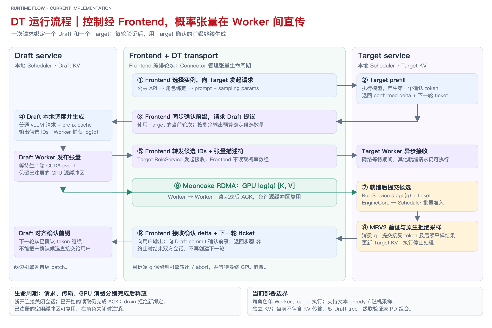
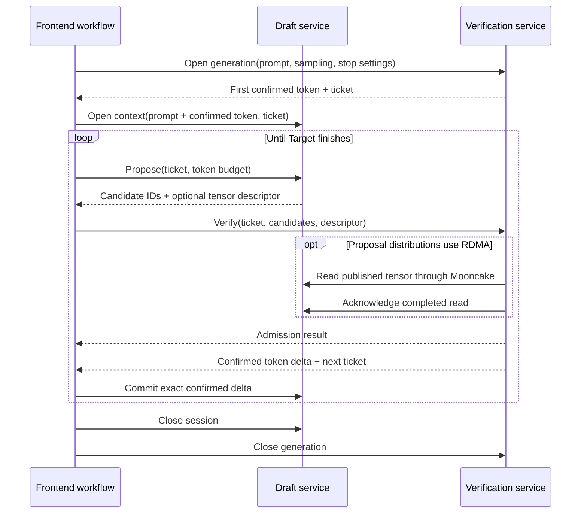

<!--
SPDX-License-Identifier: Apache-2.0
SPDX-FileCopyrightText: Copyright contributors to the Foretoken project
-->

# [RFC] Draft/Target disaggregation for speculative decoding

Status: proposed for maintainer review. Implementation: [PR #199](https://github.com/shiweijiezero/foretoken/pull/199).

## Summary

Add an independently deployable Draft service to Foretoken's existing main-model
service. Users select both models and provision their pools separately. The
frontend selects one instance from each pool, asks Draft for candidate tokens,
submits them to the main model for verification, and returns only main-model
confirmed output through the existing completion APIs.

The delivery has two boundaries:

- A standalone `foretoken_dt` vLLM plugin supplies Draft and verification services,
  including the cross-host transport. It can run without Foretoken.
- Foretoken integrates those services with ModelService deployment, discovery,
  instance selection, generation, streaming and drain.

Both NVIDIA and MetaX (MACA) are required delivery platforms. The current
NVIDIA validation is partial delivery evidence; it does not complete this scope.

Target names the main model's verification responsibility. It does **not** require
another public deployment role: phase one uses two `aggregate` pools and identifies
the Draft pool through `speculation.draftPool`.

## Motivation and expected benefits

Co-located speculative decoding places Draft execution and its model state beside
the main model. Their resource requirements and desired replica counts need not
match. A small Draft model may serve several main-model instances, while a large
main model may occupy most of its GPU memory and benefit from moving Draft work
elsewhere. Independent placement also permits choosing suitable hardware and
changing either pool's capacity without coupling their replica counts.

DT disaggregation provides that deployment and execution boundary. It should make
it possible to:

1. Choose compatible Draft and main models independently.
2. Allocate and scale Draft capacity separately from verification capacity.
3. Keep ready main-model requests executing while other requests await proposals.
4. Add future multi-Draft algorithms without placing cluster routing inside an
   engine's model execution loop.

These are architectural benefits and performance opportunities, not a measured
speedup. Phase one advances one round at a time per request. Its approximate
steady-state cost per confirmed token is:

```text
T_DT = (T_draft + T_transfer + T_verify + T_coordination) / E[confirmed tokens per round]
```

Verification can confirm several tokens with one main-model forward pass, but
remote transport and coordination add work. Separating the GPUs alone does not
overlap dependent rounds. Draft prefix recomputation and transmission of full
proposal distributions can also outweigh the saved main-model work. Performance
comparison follows functional acceptance and is outside this change's immediate
validation scope.

## Architecture


### Deployment and model identity

The main model remains `spec.model`. The named Draft pool supplies its own `model`.
Both pools execute complete models, so both retain the existing Aggregate stage:

```yaml
spec:
  model: Qwen/Qwen3-4B
  source: hf
  backend: vllm
  speculation:
    draftPool: draft
  modelPools:
    - name: draft
      role: aggregate
      model: Qwen/Qwen3-0.6B
      replicas: 1
      # GPU and memory requests omitted here.
    - name: main
      role: aggregate
      replicas: 1
      # GPU and memory requests omitted here.
```

The [maintained example](../../examples/draft-target/model.yaml) contains the full
resource configuration. The controller derives internal Draft/Target launch
responsibilities from this relationship; clients do not configure a new public
`target` role. Removing `speculation` restores ordinary serving through a rollout.

The controller owns pool creation, model preparation, readiness publication and
drain. Each pool consumes its own resolved model artifacts. Prepared filesystem
paths are loading details: discovery retains the configured model/tokenizer
identity and publishes resolved tokenizer metadata for frontend preparation.
The frontend checks the role's identity, context limit, admission state and
candidate format before routing to it.

Users must choose models with compatible token-ID meanings. Equal vocabulary
sizes alone are insufficient, and this implementation does not translate between
tokenizers or negotiate compatibility automatically.

### Component responsibilities

| Component | Owns | Receives → produces |
| --- | --- | --- |
| Controller | Desired pools, replicas, rollout and discovery | ModelService → independently managed instances and serving snapshot |
| Router selection | Filter–Scorer–Picker decisions and request reservations | Request and eligible instances → one Draft and one main-model instance |
| Frontend DT workflow | Per-request stage order, paired sessions and cancellation | Bound pair and prompt → verified output stream |
| Draft service | Confirmed context and proposal lifecycle | Current context and budget → candidate tokens and proposal-distribution descriptor |
| Verification service | Main-model request and verification admission | Prompt, candidates and ticket → confirmed deltas and next ticket |
| Each EngineCore/Scheduler | Local runnable requests, batching, preemption and KV allocation | Ready requests → local execution batches |
| Each Worker/ModelRunner | Device execution, tensor slots and sampling | Scheduled batch → proposals or verified results |
| DT Connector | Tensor publication, transfer completion and buffer lifetime | Source descriptor → destination tensor ready for verification |

There are three distinct scheduling responsibilities. The controller changes
capacity. Router selection chooses instances. The frontend workflow orders
proposal and verification operations. Local vLLM schedulers independently decide
which ready requests share a GPU batch. None of these requires a global scheduler
that owns both models' KV caches.

One request binds one Draft and one verifier until completion. Multiple replicas
serve different requests; they do not jointly construct a proposal for one request.
The frontend owns this binding and its load reservations throughout the session.
The controller publishes ready committed replicas as `dt_components` in its
serving snapshot. The public `models` entry retains the main-model and tokenizer
identity; each component separately identifies its loaded `engine_model`, engine
revision, service, pool, route ID, pipeline scope and endpoint. A Draft can
therefore load different weights without becoming another public model. A valid
scope contains both responsibilities for the same service and public model.

Router selection chooses the verifier first, then an eligible Draft in that scope.
Both reservations survive until completion, cancellation or failure. Invalid
snapshot updates leave the active serving generation intact. Drain excludes a
replica after discovery refresh; it does not change an existing request binding.

Native DT queue-depth and KV gauges are currently unavailable, so selection can
use frontend reservations but must not interpret missing engine observations as
zero load.

## Request execution



### Opening the request and advancing a round



The initial main-model prefill produces the first token without Draft. The
frontend then opens Draft with the prompt plus the confirmed prefix. Draft
proposes up to the configured candidate budget. The verifier checks those
candidates in the main model, performs rejection sampling, and returns the
confirmed delta on its existing generation stream.

For example, suppose the confirmed prefix is `P`, and Draft proposes `[a,b,c]`.
If verification accepts `a` and rejects `b`, the main model samples a replacement
`x`. The committed delta is `[a,x]`; the next Draft context is `P+[a,x]`, not
`P+[a,b,c]`. If all candidates are accepted, verification can produce an additional
main-model token, subject to stopping and length limits.

Only the verifier can commit output. The frontend forwards its text delta to the
client and its exact token delta to Draft. It must not rebuild model context by
re-tokenizing displayed text: stop handling can make those boundaries differ.
A terminal commit ends the loop without opening another round.

### Tickets and asynchronous admission

The plugin associates the main-model request with an engine ticket containing
its request identity and confirmed generation frontier. The role protocol carries
that frontier as `version`; it is not a Draft KV length or a buffer identifier.
Candidate submission must match the live request's current waiting ticket.
Stale, duplicate and already-consumed submissions cannot advance it.

The engine interface is concrete:

```python
ExternalDraftRequest(request_id: str, generation: int)
RequestOutput.external_draft_request: ExternalDraftRequest | None
await ExternalAsyncLLM.submit_external_draft_tokens(ticket, token_ids) -> bool
```

`request_id` is vLLM's internal request ID, retained from its output collector;
`generation` is the cumulative number of confirmed output tokens. The plugin
attaches the ticket after native output/stop handling and issues none on terminal
output. This avoids modifying the native cross-process output schema. The HTTP
session maps its version back to this engine ticket.

| Request transition | Owner and action | Effect on remote candidates |
| --- | --- | --- |
| Prefill or verification produces nonterminal output | Native output processing commits tokens; plugin Scheduler marks the request waiting | Next ticket identifies the new confirmed frontier |
| Current candidate submission arrives | EngineCore utility handler checks live request, waiting state, generation, length and token IDs | Admit once and make the request runnable |
| GPU batch executes | Runner maps request identity to current slots and consumes ready tensors | Verification determines the next committed delta |
| Native KV preemption occurs | Scheduler clears waiting/eligibility state before native preemption and replay | Old waiting admission is invalidated; replay must advance the frontier before a new ticket is used |
| Request finishes or aborts | Engine lifecycle removes the request; role releases owned work safely | Further submissions cannot reopen it |

Tickets do not retain a KV allocation or promise that a request will never be
preempted. A rejected submission is not silently retargeted to another generation.

While waiting, the request remains in native scheduler state and remains
preemptible, but is excluded from execution. Other ready requests continue to
batch. Candidate arrival enters EngineCore through its utility queue, marks the
request eligible and lets the next native scheduling step select it. The HTTP
handler does not block the GPU execution loop waiting for network data.

`verify.accepted` means that the engine **admitted the submission**, not that the
main model accepted its tokens. Token acceptance is known only after verification
and appears in the committed output. An empty candidate list requests an ordinary
main-model step; it does not constitute automatic recovery from a failed peer.

### Batch construction and local KV state

Both engines retain vLLM's local batch scheduling. The plugin does not assemble a
cross-service batch. Request identity and generation tickets connect a proposal
to its verifier request; batch row indices cannot do so because either engine may
reorder, preempt or batch it with different requests.

On the verifier, the adapter maps ready candidates and distributions to the
current MRV2 request slots before preparing model inputs. It then uses native
forward execution and rejection sampling. No local Draft model runs there.

Each model owns its own KV cache. Phase one transfers no KV between them. Draft
creates an ordinary vLLM generation request for each proposal round using the
confirmed prefix; native automatic prefix caching may reuse computed blocks.
This avoids introducing another KV allocator, but does not guarantee that every
Draft tail survives between rounds. Request setup and partial-block recomputation
remain costs to measure.

## Connector and sampling correctness

### What crosses the boundary

| Data | Path | Reason |
| --- | --- | --- |
| Prompt, candidates, confirmed deltas, tickets and cancellation | Internal HTTP APIs | Maintain request state and advance rounds |
| Tensor descriptor and publication identity | HTTP, relayed by frontend | Identify the immutable source tensor without copying it through frontend |
| Full Draft proposal `log(q)` rows | Worker-to-worker Mooncake RDMA | Supply the distribution needed by stochastic rejection sampling |
| Transfer acknowledgement | Destination to source HTTP | Permit release of the published source tensor after the read completes |

For probabilistic proposals, a token's acceptance depends on the main-model
probability `p` and Draft probability `q`. Rejection also needs the residual
distribution proportional to `max(p-q,0)`. Candidate IDs or their individual
probabilities do not provide that full distribution.

A `PayloadRef` contains `publication_id`, `segment`, `address`, `nbytes`, `dtype`
and `shape`. The artifact ID identifies the proposal lifecycle; the publication
ID identifies a particular immutable export of registered storage. Target checks
the layout and allocates its own destination storage. The frontend passes this
descriptor without dereferencing device addresses or serializing tensor values.

The Draft adapter captures the actual distribution after its sampling
transformations, including temperature and truncation, and publishes float32
normalized log probabilities with shape `[candidate_count, vocabulary_size]`.
For a greedy Draft draw, the row is zero at the chosen token and negative infinity
elsewhere. The verifier supplies `log(q) * target_temperature` to the native
sampler, whose own temperature division recovers `log(q)`; a greedy Target uses
unit scaling. This preserves the already processed Draft distribution instead of
applying Draft sampling transformations a second time. Draft random draws are
independent of the Target RNG; a Target seed does not imply identical sequences
across different proposal schedules.

Without RDMA, the supported path uses greedy token candidates. With RDMA, both
roles advertise `token_ids_log_probs`; random sampling requires that format on
both sides. The connector uses Mooncake's transfer engine directly between
workers. RDMA network resources must be available on both hosts; it is not a KV
handoff or a requirement that the frontend be RDMA-connected.

### Buffer ownership and cancellation

A proposal tensor becomes publishable only after its producing GPU work completes.
Its source owns and retains the registered memory until the destination confirms
the read. The destination owns its received tensor until sampling completes or
request abort makes release safe.

These are different events:

1. **Transfer ACK:** the source bytes are no longer needed by the remote read.
2. **Candidate admission:** EngineCore accepted a current ticket and ready input.
3. **Token commit:** verification determined the authoritative next prefix.

HTTP cancellation does not prove that an RDMA operation stopped. The read and ACK
task must finish independently of its HTTP caller; source registration must not
be freed early. Uncertain transfer failure can retain memory until process exit.
The Worker owns a background transport event loop for reads and release work;
the model execution loop does not poll the network. Producer device events fence
writes before publication. Read completion fences DMA, and the last local GPU-use
event fences destination reuse. These three conditions cannot substitute for one
another.

Buffers return to a Worker-owned pool keyed by exact tensor shape. Registration
persists across rounds to preserve remote registration keys, so peak concurrent
buffers for each shape can remain allocated until shutdown. Registered-buffer
reuse and artifact release are separate: an idle reusable buffer is not an
outstanding proposal. The [connector contract](../../data-plane/dt-plugin/docs/connector-contract.md)
defines descriptors and ownership in detail.

## Role interfaces and failure behavior

The standalone plugin exposes the same internal protocol consumed by Foretoken:

| Endpoint | Input | Result |
| --- | --- | --- |
| `GET /status` | — | Identity, context limit, admission state, candidate format, budget and resource counts |
| Target `POST /generate` | Prompt tokens, sampling and stop/length settings | NDJSON session-open and committed-output events |
| Draft `POST /sessions` | Confirmed prefix, version and sampling | Session-open stream, kept open for the session lifetime |
| Draft `POST /sessions/{id}/propose` | Current version and candidate budget | Token IDs and optional artifact descriptor |
| Target `POST /sessions/{id}/verify` | Version, candidate IDs, artifact and source endpoint | Admission result; output arrives on the generation stream |
| Draft `POST /sessions/{id}/commit` | Base/new version and confirmed delta | Updated confirmed context |
| `DELETE /sessions/{id}` | Session identity | Idempotent session cancellation |
| `POST /drain` | — | Close new admission while existing sessions finish |

Each Draft session allows one outstanding proposal. Conflicting context updates
return 409; malformed requests return 422. If generation fails after streaming
headers have been sent, the stream terminates without a successful terminal event.
The frontend treats that as failure and cancels the paired session.

Closing the lifetime streams cancels their sessions. Closing only a proposal
response is not the Draft session's cancellation boundary. There is no transparent
session migration or replay after a role process restarts.

Drain excludes the instance from new selections while keeping it reachable for
existing rounds. Shutdown waits for sessions and retained artifacts, subject to
the configured drain timeout, before terminating the managed process group.
Changing replicas does not migrate live model or connector state.

### Public request semantics

The frontend adapter accepts the existing normalized `GenerateRequest` and returns
the existing `TokenStream`. Text/chat decoding, public request identity, prompt
metadata, finish reasons, deadlines and client backpressure stay with the normal
frontend path. No separate public DT API is required.

| Request behavior | Phase-one handling |
| --- | --- |
| Candidate count | Minimum of both roles' advertised budgets and the remaining output budget |
| Context length | Prompt plus requested output must fit both models' reported context limits |
| Temperature, top-p, top-k, Target seed | Forwarded; random sampling requires probability-bearing candidates on both roles |
| EOS, stop tokens, min/max output length | Forward the frontend-normalized token policy; disable independent Python EOS inference |
| Stop strings | Existing frontend decoder handles them; the lower-level standalone role API can separately accept Python-side stop strings |
| Non-default penalties, min-p, logprobs, structured output | Reject before opening role sessions |
| Multimodal input, LoRA, KV/EC transfer, cache salt, priority, tracing headers, nonzero DP rank | Not supported by this frontend DT path; reject instead of silently dropping fields |

Validation applies after model generation defaults are resolved. For example,
a model's inherited `repetition_penalty: 1.1` is unsupported even when the client
omits the field. Requesting `1.0` disables that penalty and changes the sampling
policy; it is not equivalent support for the original request.

The returned stream owns both remote lifetime streams across every await. Dropping
it cancels both sessions, including during a proposal. Terminal output releases
those owners before being yielded, so retaining an exhausted stream cannot retain
remote sessions. Backpressure does not spawn detached proposal work. EOF without
a terminal commit is an error, not successful completion.

### Health, admission and shutdown observations

`/healthz` and `/readyz` report engine health and remain healthy during drain to
keep Kubernetes routing available for existing sessions. New-request admission is
separate: `/status.accepting` and registry refresh exclude drained instances.
`POST /v1/internal/admission/close` integrates with the existing controller drain.
`GET /v1/internal/telemetry` reports owned sessions as `running_requests`; native
scheduler/KV gauges and token counters remain unknown, not zero.

The supervisor additionally reads `retained_artifacts`. Zero sessions alone does
not establish that remote reads or GPU consumers have released their memory.
It waits for both counts within the shutdown deadline, then terminates the managed
process group. This reuses the existing deployment lifecycle without pretending
that request count measures GPU occupancy.

## Implementation changes

### Standalone vLLM integration

`foretoken_dt` is an installable package registered through `vllm.general_plugins`.
The adapter targets native vLLM `0.30.1rc1.dev194+g3b4566c5c`. It installs bounded
runtime hooks without editing installed vLLM source files. Compatibility with
other engine versions is not implied.

| Integration point | Reused native behavior | Plugin change |
| --- | --- | --- |
| AsyncLLM | Request processing, output stream, stop handling and abort | Retain engine request identity and attach generation tickets |
| EngineCore | Process lifecycle and utility queue | Admit external candidates and report no executable work when only remote waiters remain |
| Scheduler | Scheduling, KV allocation, batching and preemption | Wait/resume eligibility, ticket validation and candidate metadata |
| Worker / MRV2 | Device lifecycle, input preparation and model execution | Select plugin Runner and place external candidates in current request slots |
| Sampler | Native sampling and rejection algorithm | Capture Draft distributions and supply received distributions during verification |
| Worker extension | Device-local execution | Own Mooncake registrations, proposal tensors, reads and releases |

The verifier selects `method="external"` without loading local Draft weights or
constructing a local speculator. Its Scheduler updates CPU candidate state, but
that alone is insufficient: MRV2 input preparation reads
`req_states.draft_tokens`. The plugin fills that persistent GPU state **after**
request-slot updates and before input preparation, then makes the matching
received distributions available during native rejection sampling.

For RDMA Draft, the per-round request carries
`SamplingParams.extra_args["dt_artifact_id"]`. The sampler uses its materialized
processed-logit path so the Worker can capture the distribution actually used for
sampling. `DraftTargetWorkerExtension`, selected through `worker_extension_cls`,
publishes it without copying the full matrix into the HTTP process. On Target,
Worker RPCs receive and stage the artifact against the engine request/generation;
only then does the role submit token IDs through EngineCore's utility queue.
Neither Scheduler nor EngineCore needs Mooncake-specific code.

MRV2 is ModelRunner v2, below EngineCore/Executor/Worker. It is not a separate
service or a second scheduler. The adapter uses native class-selection interfaces
where available; missing Runner construction and EngineCore admission hooks need
small runtime substitutions. Factory bindings are restored after their scoped
construction/loading operations. Upgrades therefore require checking these engine
internals even though the delivered package is a plugin.

The normal model-server image installs the distribution into the engine's Python
environment. The launcher extends an inherited `VLLM_PLUGINS` allowlist so spawned
processes load it. Standalone operation requires the matching native engine,
PyTorch and platform Mooncake environment; installation of `foretoken_dt` does not
install an engine or register a `vllm serve` mode. Its entry point is
`foretoken-dt-role --role draft|target`, with model/tokenizer options inherited from
vLLM, candidate budget defaulting to three, and `--rdma-host` enabling transport.

NVIDIA source builds select the supported CUDA engine runtime. The model-server
image also retains existing profiling, readiness-metadata and offload backports;
those are separate from DT's process-local hooks. Therefore an unchanged-wheel
check in standalone validation does not imply an unpatched production image.
Rust build sources and the installed Python runtime are independently pinned. Ordinary serving continues
through its native execution path when no DT launch responsibility is configured.

### NVIDIA and MetaX support

Both platforms must implement the same role protocol, ticket semantics, proposal
sampling contract and transfer ownership. Frontend routing and orchestration must
not acquire accelerator-specific branches. Hardware and engine differences belong
in the vLLM adapter and the existing platform runtime images.

| Boundary | Shared behavior | Platform work |
| --- | --- | --- |
| Role services and frontend | Open/propose/verify/commit, confirmed output and cancellation | Reuse without introducing vendor-specific wire messages |
| Engine adapter | Waiting tickets, candidate admission and request-slot association | Integrate with each runtime's actual EngineCore, Worker, Runner and sampler; preserve MetaX platform initialization |
| Sampling | Export actual processed Draft probabilities and perform correct rejection sampling | Verify available kernels, temperature/truncation behavior and numeric behavior on each platform |
| Device and transfer lifetime | Publish after producer completion; release after read ACK or safe GPU completion | Verify MACA tensor registration, streams/events and Mooncake RDMA completion with the platform build |
| Packaging and deployment | Install one DT package through the existing model-server build | Use the appropriate NVIDIA or MetaX runtime, drivers, libraries and device resources |

The existing [MetaX runtime](../../deploy/inference-engines/vllm-metax/Dockerfile)
already builds Mooncake with `USE_MACA=ON` and configures
`MC_MACA_HOST_TRANSPORT=1`. Reuse that build rather than install the CUDA Mooncake
wheel into the MACA environment. Its
[pinned source environment](../../deploy/inference-engines/vllm-metax/source-environment.json)
currently uses core vLLM `0.30.0.dev0` and vLLM-MetaX `0.29.0.dev0`, whereas the DT
adapter accepts only `0.30.1rc1.dev194+g3b4566c5c`. That mismatch currently prevents
DT startup on the repository's MetaX runtime. Removing the version check alone
would not establish compatibility.

MetaX integration must first inspect the platform-selected Worker/Runner and its
supported candidate-verification path, then adapt the existing DT admission and
sampling hooks at those boundaries. It must not bypass the vendor's device or
attention initialization by unconditionally selecting an upstream GPU Worker.
Where interfaces match, share the implementation; keep necessary version/platform
adaptations local to the engine adapter rather than duplicate the role service.

The current launcher also defaults NVIDIA-oriented batch-invariant execution on.
The MetaX path needs an explicitly supported numerical configuration instead of
inheriting this assumption. Likewise, CUDA-compatible Torch API spelling alone
does not prove that event ordering and GPU memory registration work on MACA.

Completion requires standalone Draft/verification generation and cross-host RDMA
on each platform, followed by Foretoken routing, streaming, cancellation and drain
through each platform's packaged image. Check greedy results under a matched
supported numerical configuration and validate the stochastic proposal-distribution
path. A CPU transfer test or successful image build is insufficient. Mixed-vendor
Draft/Target pairs need separate compatibility evidence; neither homogeneous
platform run establishes that result.

### Foretoken integration

| Area | Concrete change | Existing owner retained |
| --- | --- | --- |
| ModelService/Pool contract | Draft-pool reference and per-pool model; derive speculation responsibility separately from deployment stage | Existing normalization, validation and controller reconciliation |
| ModelGroup workload | Launch Draft or verifier, allocate RDMA resources when configured, keep same-service transfer connectivity | Existing Deployment, NetworkPolicy, readiness and drain lifecycle |
| Model preparation | Load each pool's prepared snapshots while preserving discovery identity and tokenizer metadata | Existing preparation and RuntimeCache machinery |
| Model-server | Supervise installed role application and wait for session/transfer drain | Existing process-group and shutdown owner |
| Backend registry | Probe role identity, compatibility and admission before publishing a route | Existing serving snapshots and health refresh |
| Router | Select eligible Draft and verifier independently, retaining both reservations | Existing Filter–Scorer–Picker pipeline |
| Frontend execution | Run proposal/verify/commit loop and paired cancellation; stream only confirmed output | Existing public API and workflow dispatch |
| Images | Install the plugin and supported native engine/Mooncake dependencies | Existing source-image build and deployment workflow |

The principal implementation locations are the
[plugin](../../data-plane/dt-plugin/),
[model-server supervisor](../../data-plane/model-server/src/draft_target.rs),
[selection pipeline](../../data-plane/frontend/src/router/src/selection/pipeline_router.rs)
and [frontend DT workflow](../../data-plane/frontend/src/server/src/draft_target.rs).
No separate controller or generic distributed workflow engine is introduced.

## Scope and extension boundaries

Phase one requires NVIDIA and MetaX support for text, linear candidates, one GPU
worker per role instance, eager execution and synchronous local vLLM scheduling. Network admission is
asynchronous with respect to GPU scheduling; this does not mean vLLM's optional
async-scheduling mode is enabled.

The following require additional design and are not enabled by this RFC:

- **PD/EPD composition:** Prefill would prepare the main-model state and Decode
  would verify candidates. This needs an explicit handoff and Draft context
  preparation. The current internal route-role representation also needs to
  separate execution stage from speculation responsibility before composition.
- **Multiple Drafts, trees and cascades:** The frontend workflow would select and
  advance more participants. A tree verifier needs branch topology and attention
  semantics; an intermediate verifier must expose the resulting proposal
  distribution. Concatenating candidates does not implement either algorithm.
- **Multimodal input:** Draft needs a defined representation of the conditioned
  context. Moving prefill alone does not settle how different models interpret
  that context during decoding.
- **KV transfer/offload and session migration:** These need model-specific state
  and ownership contracts beyond the current proposal-tensor connector.
- **Metric-driven autoscaling:** Pools are independently provisioned, but native
  scheduler/KV observations and a DT capacity policy are not delivered here.

The boundaries above leave room for extension without adding unused fields or
promising compatibility with an unspecified tree or hidden-state protocol.

## Validation and review criteria

Existing pre-merge evidence covers standalone native-plugin execution across two
A100 hosts with Mooncake RDMA, greedy parity against the empty-candidate verifier
path, concurrent requests, random-sampling completion, cancellation and cleanup.
The production frontend has also exercised public streaming, Draft replica
selection, ineligible-node exclusion and drain through static discovery.

A Kubernetes run on 2026-09-29 exercised controller-created pools, public requests
and DT → Aggregate → DT rollout using two local GPUs without RDMA. The normal
image also launched ordinary Aggregate generation. These results establish those
specific functional paths, not statistical sampling equivalence, cross-node
Kubernetes RDMA correctness, uninterrupted scale-down or a performance advantage.
They predate the latest main-branch model-preparation integration; merge checks
and new validation must identify their own coverage rather than inherit them.

MetaX DT execution, its platform adapter and cross-host RDMA acceptance are still
outstanding. They are required deliverables, not deferred multi-Draft features.

Review should establish that:

1. Public deployment stages retain their meaning and Draft cannot accidentally
   serve as the public main model.
2. Only current-ticket candidates execute, and only verified tokens advance
   either side's committed context.
3. Waiting for remote input leaves unrelated engine work runnable.
4. Cancellation and drain preserve GPU/transfer memory ownership.
5. The standalone plugin and frontend integration exercise actual multi-round
   generation, not merely successful service startup.

Matched baseline and benefit experiments are a subsequent task. They should use
the same API, workload, sampling settings and total GPU budget, and separate
Draft, transfer, verification and coordination time before choosing optimizations.

## Related material

- [vLLM RFC: Disaggregated Speculative Decoding with Standalone Parallel Draft Model](https://github.com/vllm-project/vllm/issues/42109).
- [Standalone plugin setup](../../data-plane/dt-plugin/README.md).
- [Foretoken deployment example](../../examples/draft-target/README.md).
